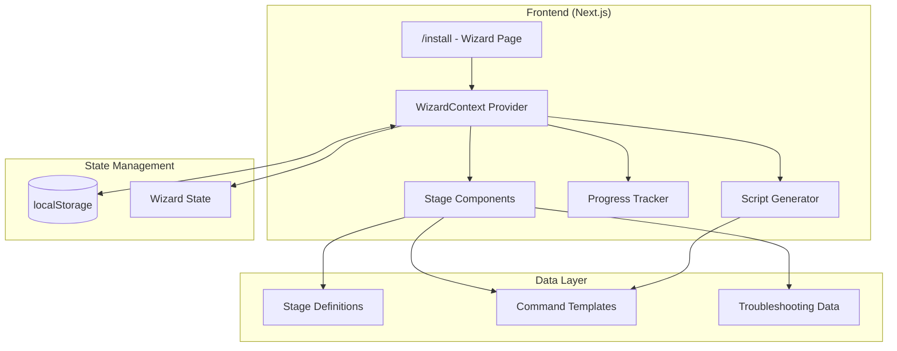

# Design Document: LFS Installer Wizard

## Overview

The LFS Installer Wizard is a React-based interactive guide that walks users through the complete Linux From Scratch build process. It provides a wizard-style interface with 12 stages, progress tracking, script generation, and platform-specific instructions. The wizard runs entirely in the browser, storing progress in localStorage, and generates shell scripts that users execute in their terminal.

## Architecture



## Components and Interfaces

### Core Components

```typescript
// Main Wizard Page Component
interface WizardPageProps {
  // No props - uses context
}

// Wizard Context
interface WizardContextType {
  currentStage: number;
  completedStages: Set<number>;
  platform: Platform;
  distro: LinuxDistro | null;
  progress: WizardProgress;
  
  setCurrentStage: (stage: number) => void;
  markStageComplete: (stage: number) => void;
  resetStage: (stage: number) => void;
  resetAllProgress: () => void;
  setPlatform: (platform: Platform) => void;
  setDistro: (distro: LinuxDistro) => void;
}

// Stage Component
interface StageProps {
  stageNumber: number;
  title: string;
  description: string;
  estimatedTime: string;
  diskSpace: string;
  isLocked: boolean;
  isComplete: boolean;
  isCurrent: boolean;
}

// Command Block Component
interface CommandBlockProps {
  command: string;
  description?: string;
  platform?: Platform;
  copyable?: boolean;
}

// Progress Sidebar Component
interface ProgressSidebarProps {
  stages: StageInfo[];
  currentStage: number;
  completedStages: Set<number>;
  onStageClick: (stage: number) => void;
}

// Script Generator Component
interface ScriptGeneratorProps {
  stageNumber?: number; // If undefined, generate all stages
  platform: Platform;
  distro?: LinuxDistro;
}
```

### Type Definitions

```typescript
type Platform = 'windows' | 'linux' | 'macos';

type LinuxDistro = 'ubuntu' | 'debian' | 'fedora' | 'arch' | 'other';

type StageStatus = 'locked' | 'available' | 'in-progress' | 'complete';

interface StageInfo {
  id: number;
  title: string;
  shortTitle: string;
  description: string;
  estimatedTime: string;
  diskSpace: string;
  prerequisites: number[]; // Stage IDs that must be complete
  commands: StageCommand[];
  troubleshooting: TroubleshootingItem[];
}

interface StageCommand {
  id: string;
  description: string;
  command: string;
  platforms: Platform[];
  distros?: LinuxDistro[]; // If specified, only show for these distros
  isOptional?: boolean;
  warningMessage?: string;
}

interface WizardProgress {
  completedStages: number[];
  currentStage: number;
  platform: Platform;
  distro: LinuxDistro | null;
  startedAt: string;
  lastUpdated: string;
}

interface TroubleshootingItem {
  error: string;
  solution: string;
  commands?: string[];
}
```

### Component Hierarchy

```
WizardPage
├── WizardProvider (Context)
│   ├── WizardHeader
│   │   ├── PlatformSelector
│   │   └── ProgressBar
│   ├── WizardContent
│   │   ├── ProgressSidebar
│   │   │   └── StageListItem (x12)
│   │   └── StageContent
│   │       ├── StageHeader
│   │       ├── StageSteps
│   │       │   └── CommandBlock (xN)
│   │       ├── TroubleshootingSection
│   │       └── StageActions
│   │           ├── MarkCompleteButton
│   │           ├── DownloadScriptButton
│   │           └── NextStageButton
│   └── WizardFooter
│       ├── ResetProgressButton
│       └── DownloadFullScriptButton
```

## Data Models

### Stage Definitions

```typescript
const STAGES: StageInfo[] = [
  {
    id: 1,
    title: "Platform Setup",
    shortTitle: "Setup",
    description: "Prepare your system for LFS building",
    estimatedTime: "15-30 min",
    diskSpace: "2 GB",
    prerequisites: [],
    commands: [...],
    troubleshooting: [...]
  },
  {
    id: 2,
    title: "Mount Point Creation",
    shortTitle: "Mount",
    description: "Create the LFS directory structure",
    estimatedTime: "5 min",
    diskSpace: "10 GB",
    prerequisites: [1],
    commands: [...],
    troubleshooting: [...]
  },
  // ... stages 3-12
];
```

### localStorage Schema

```typescript
interface StoredProgress {
  version: number; // Schema version for migrations
  progress: WizardProgress;
}

// Key: 'lfs-wizard-progress'
// Value: JSON.stringify(StoredProgress)
```

## Correctness Properties

*A property is a characteristic or behavior that should hold true across all valid executions of a system-essentially, a formal statement about what the system should do. Properties serve as the bridge between human-readable specifications and machine-verifiable correctness guarantees.*

### Property 1: Platform Detection Consistency
*For any* user agent string, the platform detection function SHALL return exactly one of: 'windows', 'linux', or 'macos', and the result SHALL be deterministic for the same input.
**Validates: Requirements 1.1, 1.2**

### Property 2: Progress Persistence Round-Trip
*For any* valid wizard progress state, saving to localStorage and then loading SHALL produce an equivalent progress state.
**Validates: Requirements 15.1, 15.2**

### Property 3: Stage Prerequisite Enforcement
*For any* stage with prerequisites, the stage SHALL be locked (not accessible) until all prerequisite stages are marked complete.
**Validates: Requirements 15.4**

### Property 4: Command Platform Filtering
*For any* stage and platform combination, only commands matching that platform SHALL be displayed to the user.
**Validates: Requirements 2.1, 3.1**

### Property 5: Distro-Specific Command Selection
*For any* Linux distro type, the dependency installation commands SHALL match the correct package manager (apt for Ubuntu/Debian, dnf for Fedora, pacman for Arch).
**Validates: Requirements 3.2, 3.3, 3.4**

### Property 6: Script Generation Completeness
*For any* stage, the generated script SHALL contain all non-optional commands for that stage in the correct order.
**Validates: Requirements 16.2, 16.3**

### Property 7: Progress Bar Accuracy
*For any* set of completed stages, the progress percentage SHALL equal (completed stages / total stages) * 100.
**Validates: Requirements 15.3**

### Property 8: Stage Reset Cascade
*For any* stage that is reset, all stages that depend on it (have it as a prerequisite) SHALL also be reset.
**Validates: Requirements 15.5 (implied from reset behavior)**

### Property 9: Time Estimate Validity
*For any* stage, the estimated time SHALL be a positive duration string in a valid format (e.g., "15 min", "2-4 hours").
**Validates: Requirements 18.1, 18.3**

### Property 10: Command Copy Functionality
*For any* command block with copyable=true, clicking the copy button SHALL place the exact command text in the clipboard.
**Validates: Requirements 8.2, 8.3**

## Error Handling

### User Errors
- **Invalid stage navigation**: Prevent access to locked stages with visual feedback
- **Progress corruption**: Validate localStorage data on load, reset if invalid
- **Platform mismatch**: Warn if detected platform changes between sessions

### System Errors
- **localStorage unavailable**: Fall back to session-only state with warning
- **Clipboard API unavailable**: Show manual copy instructions
- **Script download failure**: Provide copy-to-clipboard fallback

### Error Display
```typescript
interface WizardError {
  type: 'warning' | 'error';
  message: string;
  action?: {
    label: string;
    onClick: () => void;
  };
}
```

## Testing Strategy

### Dual Testing Approach

The wizard will use both unit tests and property-based tests:

1. **Unit Tests** (Jest + React Testing Library)
   - Component rendering tests
   - User interaction tests (clicks, navigation)
   - Edge cases (empty states, error states)

2. **Property-Based Tests** (fast-check)
   - Platform detection with random user agents
   - Progress persistence round-trips
   - Stage prerequisite validation
   - Script generation completeness

### Property-Based Testing Library
- **Library**: fast-check (npm package)
- **Minimum iterations**: 100 per property
- **Test file location**: `__tests__/wizard.property.test.ts`

### Test Annotations
Each property-based test will be annotated with:
```typescript
/**
 * Feature: lfs-installer-wizard, Property 1: Platform Detection Consistency
 * Validates: Requirements 1.1, 1.2
 */
```

### Key Test Scenarios

1. **Platform Detection**
   - Test with various user agent strings
   - Verify deterministic results

2. **Progress Management**
   - Save/load round-trip
   - Stage completion flow
   - Reset functionality

3. **Command Generation**
   - Platform filtering
   - Distro-specific commands
   - Script generation

4. **UI State**
   - Stage locking/unlocking
   - Progress bar updates
   - Navigation between stages
