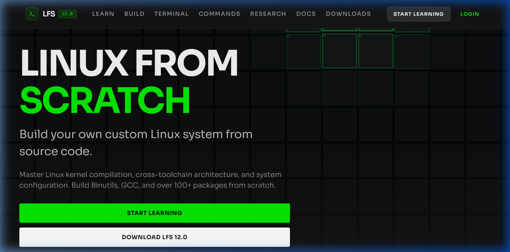
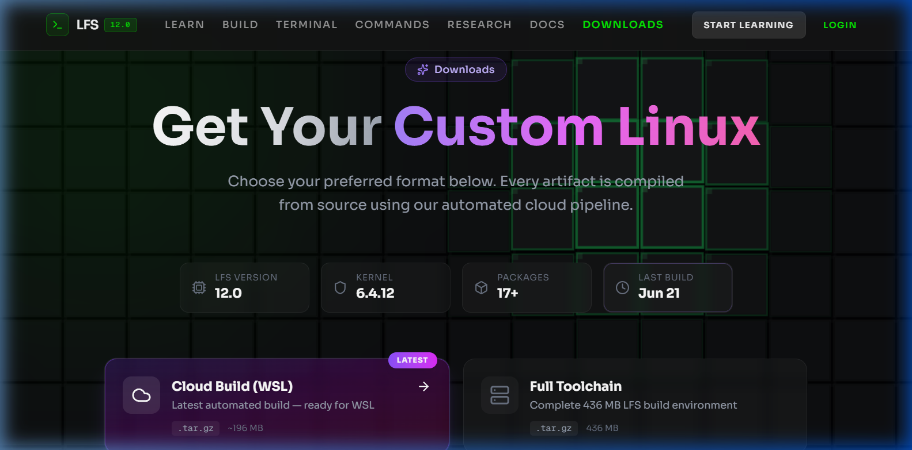
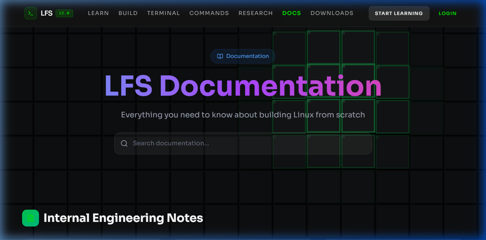
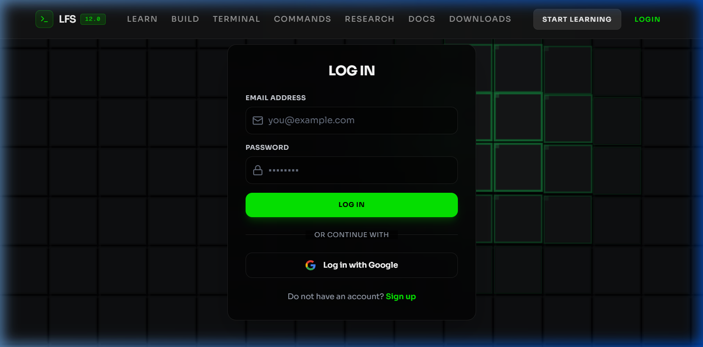
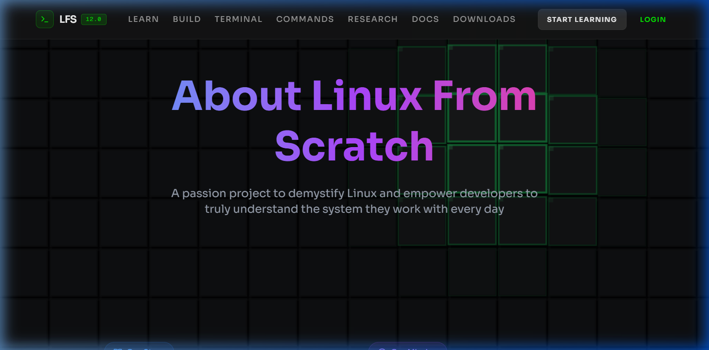

<div align="center">


<br/><br/>

```
██╗     ███████╗███████╗    ██████╗ ██╗   ██╗██╗██╗     ██████╗ ███████╗██████╗
██║     ██╔════╝██╔════╝    ██╔══██╗██║   ██║██║██║     ██╔══██╗██╔════╝██╔══██╗
██║     █████╗  ███████╗    ██████╔╝██║   ██║██║██║     ██║  ██║█████╗  ██████╔╝
██║     ██╔══╝  ╚════██║    ██╔══██╗██║   ██║██║██║     ██║  ██║██╔══╝  ██╔══██╗
███████╗██║     ███████║    ██████╔╝╚██████╔╝██║███████╗██████╔╝███████╗██║  ██║
╚══════╝╚═╝     ╚══════╝    ╚═════╝  ╚═════╝ ╚═╝╚══════╝╚═════╝ ╚══════╝╚═╝  ╚═╝
```

### **Build Your Own Linux System — From Zero to Bootable**

*Interactive learning platform · Cloud build pipeline · Multiple download formats*

**[🌐 Live Site](https://lfs-learning-platform.vercel.app)** · **[📖 Docs](https://lfs-learning-platform.vercel.app/docs)** · **[⬇️ Downloads](https://lfs-learning-platform.vercel.app/downloads)** · **[🏗️ Cloud Build](https://lfs-learning-platform.vercel.app/build)**

</div>

---

## 📌 What Is This?

**Linux From Scratch Builder** is a full-stack platform that teaches you how to compile a custom Linux operating system from source code — exactly as described in the LFS Book 12.0. It combines:

- 🎓 A **structured learning platform** with interactive lessons and progress tracking
- ☁️ An **automated Google Cloud Run pipeline** that compiles the full LFS system (so you don't have to wait 6+ hours locally)
- 📦 **Ready-to-use artifacts**: WSL tarball, bootable ISO, full toolchain, and Windows installer
- 🔐 **Firebase authentication** with per-user progress saved to Firestore

> Built by [Shubham Bhasker](https://github.com/0xDracarys) as a capstone systems project — blending OS-level engineering with modern full-stack development.

---

## 📸 Screenshots

### 🏠 Homepage — Interactive Hero

> The full-screen interactive block wall background with real-time mouse parallax. The "LINUX FROM SCRATCH" heading uses fluid `clamp()` typography.

### ⬇️ Downloads — Artifact Selector

> Animated card selector lets users choose between WSL tarball, bootable ISO, full toolchain, and Windows installer. The detail panel updates live with install steps.

### 📖 Documentation

> Dynamic Markdown renderer powered by a Next.js API route. Docs are stored as `.md` files in `/public/docs/` and served with syntax highlighting.

### 👤 Authentication

> Firebase Auth-backed login page. Supports Google OAuth and email/password. The same dark glassmorphism aesthetic runs throughout the auth flow.

### ℹ️ About — Creator Profile

> Full creator profile with technical skills, project goals, GitHub links, and the platform's mission statement.

---

## 🖥️ UI / UX Design

### Design Philosophy

The platform is built around a **dark, terminal-inspired aesthetic** that mirrors the environment developers actually use when working with Linux. Every design decision reinforces the "raw systems" identity of LFS.

| Principle | Implementation |
|---|---|
| **Premium Dark Theme** | `#141414` background with carefully tuned HSL color tokens |
| **Signature Green Accent** | `hsl(119, 99%, 46%)` — a vivid, electric green referencing the Linux terminal cursor |
| **Interactive Background** | Full-canvas WebGL-style block wall with real-time mouse parallax effect |
| **Typography** | [Sora](https://fonts.google.com/specimen/Sora) (UI) + Geist Mono (code) — clean, geometric, modern |
| **Motion** | Framer Motion for page transitions, scroll-triggered reveals, and micro-animations |

### Page-by-Page UI Breakdown

```
/                    →  Hero (interactive block wall + floating CTAs)
/learn               →  Protected module list with progress cards
/learn/[id]/[lesson] →  Lesson viewer with HTML/Markdown renderer
/build               →  Cloud build trigger + live status polling
/downloads           →  Animated card selector + detail panel
/commands            →  Searchable LFS command reference (410+)
/docs/[...slug]      →  Dynamic Markdown renderer with syntax highlight
/dashboard           →  User progress overview
/research            →  Thesis/research showcase
/about               →  Creator profile & project mission
/contact             →  Formspree-powered contact form
/terminal            →  Terminal interface
/auth/login|signup   →  Firebase Auth flows
```

### Component Architecture

```
components/
├── ui/
│   ├── navigation.tsx          # Responsive nav — desktop links + mobile drawer
│   ├── landing-page.tsx        # Full homepage with all sections
│   ├── interactive-block-wall.tsx  # Canvas-based animated background
│   ├── dotted-surface.tsx      # Reusable dot-grid surface overlay
│   ├── penguin-3d.tsx          # Three.js animated Linux penguin (hero)
│   ├── hero-odyssey.tsx        # Alternative hero component
│   └── vapour-text-effect.tsx  # Animated vapor/glitch text effect
│
├── auth/
│   ├── ProtectedRoute.tsx      # HOC — redirects unauthenticated users
│   └── AdminRoute.tsx          # HOC — admin-only route guard
│
├── providers/
│   └── Providers.tsx           # Auth context + theme provider wrapper
│
├── module-list-enhanced.tsx    # Module card grid with progress
└── lesson-viewer-enhanced.tsx  # Rich lesson viewer with HTML rendering
```

### Mobile Responsiveness

- **Hamburger menu** with slide-in drawer on `< lg` screens
- All typography uses **fluid `clamp()`** sizing — never clips or overflows
- Grids collapse: `1 col → 2 col → 4 col` at `sm / lg` breakpoints
- `overflow-x: hidden` + `-webkit-tap-highlight-color: transparent` for iOS
- Touch targets minimum `44px` for accessibility compliance

---

## 🏗️ Architecture

### System Overview

```
┌─────────────────────────────────────────────────────────────────────┐
│                         USER BROWSER                                │
│                                                                     │
│   ┌─────────────┐     ┌──────────────────┐     ┌───────────────┐  │
│   │  Next.js 16 │────▶│  Firebase Auth   │────▶│  Firestore DB │  │
│   │  (App Router│     │  (Google Sign-In)│     │  (Progress)   │  │
│   │   + RSC)    │     └──────────────────┘     └───────────────┘  │
│   └──────┬──────┘                                                   │
│          │ API Routes                                               │
└──────────┼──────────────────────────────────────────────────────────┘
           │
           ▼
┌─────────────────────────────────────────────────────────────────────┐
│                      NEXT.JS API ROUTES                             │
│                                                                     │
│  /api/lfs/trigger   →  Triggers Google Cloud Run Job               │
│  /api/lfs/status    →  Polls build progress from Firestore         │
│  /api/lfs/cancel    →  Cancels running Cloud Run Job               │
│  /api/ai/chat       →  Vertex AI Gemini chat endpoint              │
│  /api/docs/[slug]   →  Serves Markdown docs from /public/docs/     │
│  /api/commands      →  LFS command reference lookup                │
│  /api/build         →  Firebase Admin build record management      │
│  /api/cloud-build   →  Cloud Build webhook handler                 │
└─────────────────────────────────────────────────────────────────────┘
           │
           ▼
┌─────────────────────────────────────────────────────────────────────┐
│                    GOOGLE CLOUD INFRASTRUCTURE                      │
│                                                                     │
│  ┌────────────────────┐      ┌──────────────────────────────────┐  │
│  │  Cloud Run Job     │      │  Cloud Storage                   │  │
│  │  (8 vCPU, 32 GB)   │─────▶│  gs://alfs-bd1e0-builds/         │  │
│  │                    │      │  ├── lfs-system.tar.gz  (196 MB) │  │
│  │  lfs-build.sh      │      │  ├── lfs-12.0-latest.iso(136 MB) │  │
│  │  Chapter 5: tools  │      │  └── lfs-12.0-toolchain.tar.gz   │  │
│  │  Chapter 6: system │      └──────────────────────────────────┘  │
│  └────────────────────┘                                             │
└─────────────────────────────────────────────────────────────────────┘
```

### Frontend Stack

| Layer | Technology | Purpose |
|---|---|---|
| Framework | Next.js 16 (App Router) | SSR + static pages + API routes |
| Language | TypeScript 5 | Type safety throughout |
| Styling | Tailwind CSS 4 | Utility-first with custom design tokens |
| Animation | Framer Motion 12 | Page transitions, scroll reveals |
| 3D / Canvas | Three.js + @react-three/fiber | Penguin 3D model, interactive canvas |
| Auth | Firebase Auth | Google OAuth + email/password |
| Database | Firestore | Build records, user progress |
| AI | Google Vertex AI (Gemini) | In-platform AI assistant |
| Forms | Formspree | Contact form without backend |

### Backend / Build Pipeline

| Layer | Technology | Purpose |
|---|---|---|
| Cloud Compute | Google Cloud Run Jobs | LFS compilation environment |
| Container | Docker (Dockerfile) | Reproducible build environment |
| Build Script | Bash (`lfs-build.sh`) | Chapter 5–8 automation |
| Storage | Google Cloud Storage | Artifact hosting |
| Admin SDK | Firebase Admin | Server-side Firestore writes |
| Deployment | Vercel | Frontend hosting (global CDN) |

### Data Flow — Cloud Build

```
User clicks "Start Build"
        │
        ▼
POST /api/lfs/trigger
        │
        ├── Creates build record in Firestore  { status: "queued" }
        │
        ├── Calls Cloud Run Jobs API
        │        ↓ (runs lfs-build.sh in container)
        │        ├── Phase 1: Download LFS sources
        │        ├── Phase 2: Build cross-toolchain (Binutils, GCC Pass 1)
        │        ├── Phase 3: Build Glibc + Libstdc++
        │        ├── Phase 4: Build minimal system (17 packages)
        │        ├── Phase 5: Package → tar.gz + ISO
        │        └── Upload artifacts to Cloud Storage
        │
GET /api/lfs/status  ← (frontend polls every 5s)
        │
        ▼
Firestore { status: "building" | "complete" | "failed", progress: 0–100 }
        │
        ▼
Download links appear when status === "complete"
```

### LFS Build Phases

```
Phase 1  ─ Environment Setup
           ├── Create $LFS directory structure
           └── Set cross-compilation environment variables

Phase 2  ─ Cross-Toolchain (Chapter 5)
           ├── Binutils 2.41 (Pass 1)  — assembler & linker
           ├── GCC 13.2.0 (Pass 1)     — cross-compiler
           ├── Linux 6.4.12 Headers    — kernel API headers
           ├── Glibc 2.38              — GNU C library
           └── Libstdc++ (Pass 1)      — C++ standard library

Phase 3  ─ Cross-Compiled Tools (Chapter 6)
           ├── M4, Ncurses, Bash, Coreutils
           ├── Diffutils, File, Findutils, Gawk
           ├── Grep, Gzip, Make, Patch
           └── Sed, Tar, Xz, Binutils (Pass 2), GCC (Pass 2)

Phase 4  ─ Building the LFS System (Chapter 8)
           ├── Man-pages, Iana-Etc, Glibc (final)
           ├── Zlib, Bzip2, Xz, Lz4, Zstd
           ├── File, Readline, M4, Bc, Flex
           ├── Tcl, Expect, DejaGNU, Pkgconf
           ├── Binutils, GMP, MPFR, MPC
           ├── Attr, Acl, Libcap, Shadow
           ├── GCC (final), Ncurses, Sed, Psmisc
           ├── Gettext, Bison, Grep, Bash
           ├── Libtool, GDBM, Gperf, Expat
           ├── Inetutils, Less, Perl, XML::Parser
           ├── Intltool, Autoconf, Automake
           ├── OpenSSL, Kmod, Elfutils, Libffi
           ├── Python 3, Flit-Core, Wheel, Setuptools
           ├── Ninja, Meson, Coreutils, Check
           ├── Diffutils, Gawk, Findutils, Groff
           ├── GRUB, Gzip, IPRoute2, Kbd
           ├── Libpipeline, Make, Patch, Tar
           ├── Texinfo, Vim, MarkupSafe, Jinja2
           ├── Udev, Man-DB, Procps-ng, Util-linux
           └── E2fsprogs, Sysklogd, Sysvinit

Phase 5  ─ System Configuration
           ├── /etc/fstab, hostname, network
           ├── Bootscripts, GRUB bootloader
           └── Package → lfs-system.tar.gz + lfs-12.0-latest.iso
```

---

## 📁 Project Structure

```
lfs-automated/
│
├── lfs-learning-platform/          # ← Next.js 16 frontend
│   ├── app/                        # App Router pages
│   │   ├── page.tsx                # Root → renders LFSLandingPage
│   │   ├── layout.tsx              # Global layout (nav, providers, bg)
│   │   ├── globals.css             # Design tokens + base styles
│   │   ├── learn/                  # Learning module pages
│   │   │   ├── page.tsx            # Module list
│   │   │   └── [moduleId]/[lessonId]/page.tsx
│   │   ├── build/                  # Cloud build UI
│   │   ├── downloads/              # Download selection UI
│   │   ├── docs/[...slug]/         # Dynamic Markdown docs
│   │   ├── commands/               # LFS command reference
│   │   ├── dashboard/              # User progress dashboard
│   │   ├── auth/                   # Login / signup pages
│   │   ├── admin/                  # Admin panel (protected)
│   │   ├── about/                  # About page
│   │   ├── contact/                # Contact form
│   │   ├── research/               # Research / thesis
│   │   ├── terminal/               # Terminal interface
│   │   └── api/                    # Next.js API routes
│   │       ├── lfs/trigger|status|cancel/
│   │       ├── ai/chat/
│   │       ├── docs/[...slug]/
│   │       ├── commands/
│   │       ├── build/
│   │       └── cloud-build/
│   │
│   ├── components/
│   │   ├── ui/                     # Design system components
│   │   ├── auth/                   # ProtectedRoute, AdminRoute
│   │   ├── providers/              # Providers.tsx (Auth + Theme)
│   │   ├── module-list-enhanced.tsx
│   │   └── lesson-viewer-enhanced.tsx
│   │
│   ├── lib/
│   │   ├── firebase.ts             # Firebase client init
│   │   ├── firebase-admin.ts       # Firebase Admin SDK init
│   │   ├── data/modules.ts         # LFS lesson content
│   │   ├── types/learning.ts       # TypeScript types
│   │   └── services/progressService.ts
│   │
│   ├── contexts/
│   │   └── AuthContext.tsx         # Firebase Auth context
│   │
│   ├── public/
│   │   └── docs/                   # Markdown documentation files
│   │
│   ├── next.config.js              # Next.js config (Vercel-optimized)
│   ├── package.json
│   └── .vercel/project.json        # Vercel project link
│
├── Dockerfile                      # Cloud Run container
├── docker-entrypoint.sh            # Container entrypoint
├── lfs-build.sh                    # Main LFS automation script (3500+ lines)
├── lfs-chapter5-real.sh            # Chapter 5: cross-toolchain
├── build-minimal-bootable.sh       # Minimal 17-package system
├── render.yaml                     # Render.com blueprint
├── cloudbuild.yaml                 # Google Cloud Build config
└── README.md                       # This file
```

---

## ⚡ Quick Start

### Run the Frontend Locally

```bash
# Clone the repo
git clone https://github.com/0xDracarys/lfs-automated-build.git
cd lfs-automated-build/lfs-learning-platform

# Install dependencies
npm install

# Set up environment variables
cp .env.local.example .env.local
# Fill in your Firebase config in .env.local

# Start dev server
npm run dev
# → http://localhost:3000
```

### Required Environment Variables

```env
# Firebase (client-side)
NEXT_PUBLIC_FIREBASE_API_KEY=
NEXT_PUBLIC_FIREBASE_AUTH_DOMAIN=
NEXT_PUBLIC_FIREBASE_PROJECT_ID=
NEXT_PUBLIC_FIREBASE_STORAGE_BUCKET=
NEXT_PUBLIC_FIREBASE_MESSAGING_SENDER_ID=
NEXT_PUBLIC_FIREBASE_APP_ID=
NEXT_PUBLIC_FIREBASE_MEASUREMENT_ID=

# Firebase Admin (server-side, JSON string)
FIREBASE_SERVICE_ACCOUNT_KEY=
```

### Deploy to Vercel

```bash
npm install -g vercel
cd lfs-learning-platform
vercel --prod --yes
```

---

## 📦 Download Artifacts

| Artifact | Size | Format | Use Case |
|---|---|---|---|
| **Cloud Build (WSL)** | ~196 MB | `.tar.gz` | Import into WSL2 — `wsl --import LFS-Cloud` |
| **Full Toolchain** | ~436 MB | `.tar.gz` | Continue building more packages |
| **Bootable ISO** | ~136 MB | `.iso` | Boot in VirtualBox, VMware, or bare metal |
| **Windows Installer** | ~184 KB | `.exe` | One-click WSL2 setup with desktop shortcuts |

All artifacts are hosted on **Google Cloud Storage** and **Firebase Storage**.

---

## 🔐 Authentication & Authorization

```
Public routes:      /  /about  /docs  /commands  /downloads  /research  /contact
Protected routes:   /learn  /learn/**  /dashboard  /build  /terminal
Admin routes:       /admin  (requires isAdmin: true in Firestore user doc)
```

Auth is handled via **Firebase Auth** (Google OAuth + email/password). A React context (`AuthContext`) makes the user object available throughout the app. Route protection is implemented via `ProtectedRoute` and `AdminRoute` HOCs.

---

## 🎨 Design Tokens

```css
/* Core Palette */
--primary:          hsl(119, 99%, 46%)   /* Electric green — brand accent */
--background:       hsl(0, 0%, 10%)      /* Deep charcoal */
--hero-bg:          hsl(0, 0%, 8%)       /* Slightly darker hero */
--foreground:       hsl(0, 0%, 96%)      /* Near-white text */
--muted-foreground: hsl(0, 0%, 60%)      /* Subdued text */
--nav-button:       hsl(0, 0%, 18%)      /* Card/button background */
--border:           hsl(0, 0%, 20%)      /* Subtle borders */

/* Typography */
--font-sora:        'Sora', sans-serif   /* UI font */
--font-mono:        'Geist Mono'         /* Code / terminal font */
```

---

## 🧱 LFS Build Info

| Component | Version |
|---|---|
| LFS Book | 12.0 |
| Linux Kernel | 6.4.12 |
| GCC | 13.2.0 |
| Glibc | 2.38 |
| Binutils | 2.41 |
| Bash | 5.2 |
| Coreutils | 9.3 |
| Build Host | Google Cloud Run (8 vCPU · 32 GB RAM) |
| Build Time | ~30 minutes |

---

## 🤝 Contributing

Contributions, issues, and feature requests are welcome!

1. Fork the repo
2. Create your branch: `git checkout -b feat/your-feature`
3. Commit: `git commit -m "feat: add your feature"`
4. Push: `git push origin feat/your-feature`
5. Open a Pull Request

---

## 👤 Author

**Shubham Bhasker**  
Linux Systems Developer · India 🇮🇳

- GitHub: [@0xDracarys](https://github.com/0xDracarys)
- Live: [lfs-learning-platform.vercel.app](https://lfs-learning-platform.vercel.app)

---

## 📄 License

MIT © 2026 Shubham Bhasker

---

<div align="center">

*Built from source. Every line. Every package. Every bit.*

**[⭐ Star this repo](https://github.com/0xDracarys/lfs-automated-build)** if it helped you understand Linux better!

</div>
