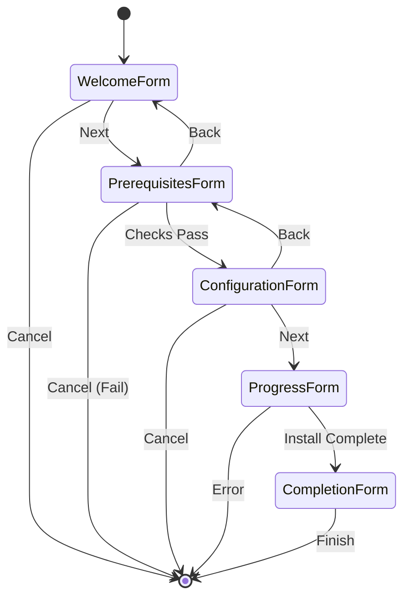

# 5.3.2. Wizard Implementation - Step-by-Step Details

## Overview

This section documents the implementation of the 5-step installation wizard, detailing each form's functionality, user interactions, and technical implementation according to ISCS methodology (Section 2.3.6 - Part of Software Implementation).

## Wizard Architecture Pattern

The installer implements the **Wizard UI Pattern** (Tidwell, 2010), guiding users through sequential steps with clear progress indication and navigation controls.

**Figure 5.2** - Wizard Navigation Flow



Source: compiled by author.

---

## Step 1: Welcome Screen (`WelcomeForm.cs`)

### Purpose
Introduces the installer, sets user expectations, and performs initial admin rights validation.

### User Interface Layout

**Figure 5.3** - Welcome Screen Layout

```
╔═══════════════════════════════════════════════════════╗
║  [LOGO]     LFS Builder Setup                         ║
║                                                       ║
║  Welcome to the Linux From Scratch Builder           ║
║  Installation Wizard                                  ║
║                                                       ║
║  This wizard will guide you through the installation  ║
║  of the LFS Builder system, including:                ║
║                                                       ║
║    ✓ Windows Subsystem for Linux 2 (WSL2)           ║
║    ✓ LFS build environment configuration             ║
║    ✓ Desktop shortcuts and tools                     ║
║                                                       ║
║  Estimated time: 10-15 minutes                       ║
║  Internet connection required                        ║
║                                                       ║
║  Click Next to begin the installation.               ║
║                                                       ║
║                         [Cancel]  [Next >]           ║
╚═══════════════════════════════════════════════════════╝
```

Source: compiled by author.

### Key Implementation Details

**Table 5.4** - WelcomeForm Components

| Component | Type | Property | Value | Purpose |
|-----------|------|----------|-------|---------|
| lblTitle | Label | Font | "Segoe UI", 16pt, Bold | Main heading |
| lblWelcome | Label | Text | "Welcome to..." | Introduction text |
| picLogo | PictureBox | Image | embedded resource | Branding |
| btnNext | Button | Text | "Next >" | Navigation |
| btnCancel | Button | Text | "Cancel" | Exit installer |

Source: compiled by author.

### Code Implementation

**Listing 5.1** - Admin Rights Check on Form Load

```csharp
private void WelcomeForm_Load(object sender, EventArgs e)
{
    // Check if running as administrator
    bool isAdmin = new WindowsPrincipal(WindowsIdentity.GetCurrent())
        .IsInRole(WindowsBuiltInRole.Administrator);
    
    if (!isAdmin)
    {
        MessageBox.Show(
            "This installer requires administrator privileges to install WSL2.\n\n" +
            "Please restart the installer with 'Run as Administrator'.",
            "Administrator Rights Required",
            MessageBoxButtons.OK,
            MessageBoxIcon.Warning
        );
        
        Application.Exit();
    }
}
```

Source: compiled by author.

**Algorithm 5.1** - Welcome Form Navigation Logic

1. User clicks "Next" button → `btnNext_Click` event fires
2. Check admin rights via `WindowsPrincipal.IsInRole()`
3. If admin: Navigate to `PrerequisitesForm`
4. If not admin: Show error message, exit application
5. User clicks "Cancel" → Show confirmation dialog → Exit if confirmed

---

## Step 2: Prerequisites Check (`PrerequisitesForm.cs`)

### Purpose
Validates system requirements before installation, preventing failures mid-process.

### User Interface Layout

**Figure 5.4** - Prerequisites Check Screen

```
╔═══════════════════════════════════════════════════════╗
║  System Requirements Check                            ║
║                                                       ║
║  Checking your system compatibility...               ║
║                                                       ║
║  ✓ Windows Version      Windows 11 Pro (22H2)       ║
║  ✓ RAM                  16 GB (8 GB required)        ║
║  ✓ Disk Space           120 GB available             ║
║  ✓ CPU Cores            8 cores (2 required)         ║
║  ✓ Virtualization       Enabled (Intel VT-x)         ║
║  ⚠ WSL2 Installed       Not found (will be installed)║
║                                                       ║
║  Status: Ready to proceed                            ║
║                                                       ║
║  All requirements met. Click Next to continue.       ║
║                                                       ║
║                [< Back]  [Cancel]  [Next >]          ║
╚═══════════════════════════════════════════════════════╝
```

Source: compiled by author.

### Validation Checks

**Table 5.5** - System Requirements Validation Matrix

| Check | Method | Pass Criteria | Failure Action |
|-------|--------|---------------|----------------|
| Windows Version | `Environment.OSVersion.Version.Build` | >= 19041 | Block with error |
| RAM | `ManagementObjectSearcher("Win32_ComputerSystem")` | >= 8 GB | Block with error |
| Disk Space | `DriveInfo.GetDrives().AvailableFreeSpace` | >= 30 GB | Block with error |
| CPU Cores | `Environment.ProcessorCount` | >= 2 | Warn, allow continue |
| Virtualization | WMI `Win32_Processor.VirtualizationFirmwareEnabled` | true | Block with error |
| WSL2 | `wsl --status` exit code | N/A | Info, will install |

Source: compiled by author based on LFS 12.0 requirements.

### Code Implementation

**Listing 5.2** - RAM Detection Using WMI

```csharp
private long GetTotalRAMInGB()
{
    try
    {
        using (var searcher = new ManagementObjectSearcher(
            "SELECT TotalPhysicalMemory FROM Win32_ComputerSystem"))
        {
            foreach (ManagementObject obj in searcher.Get())
            {
                long bytes = Convert.ToInt64(obj["TotalPhysicalMemory"]);
                return bytes / (1024 * 1024 * 1024); // Convert to GB
            }
        }
    }
    catch (Exception ex)
    {
        LogError($"Failed to detect RAM: {ex.Message}");
        return 0;
    }
    
    return 0;
}
```

Source: compiled by author.

**Listing 5.3** - Virtualization Check via WMI

```csharp
private bool IsVirtualizationEnabled()
{
    try
    {
        using (var searcher = new ManagementObjectSearcher(
            "SELECT * FROM Win32_Processor"))
        {
            foreach (ManagementObject obj in searcher.Get())
            {
                // Check for Intel VT-x or AMD-V
                var virtEnabled = obj["VirtualizationFirmwareEnabled"];
                if (virtEnabled != null && (bool)virtEnabled)
                    return true;
            }
        }
    }
    catch (Exception ex)
    {
        LogError($"Virtualization check failed: {ex.Message}");
    }
    
    return false;
}
```

Source: compiled by author.

### UI Update Pattern

**Algorithm 5.2** - Asynchronous Prerequisites Check

1. Form loads → Show "Checking..." status
2. Start async task for each check using `Task.Run()`
3. Each check updates UI via `Invoke()` for thread safety:
   - Green ✓ for pass
   - Yellow ⚠ for warning
   - Red ✗ for failure
4. All checks complete → Enable/disable "Next" button based on results
5. Display summary message: "Ready" or "Requirements not met"

---

## Step 3: Configuration (`ConfigurationForm.cs`)

### Purpose
Collects user preferences for installation paths, Linux distribution, and build settings.

### User Interface Layout

**Figure 5.5** - Configuration Screen

```
╔═══════════════════════════════════════════════════════╗
║  Installation Configuration                           ║
║                                                       ║
║  Installation Path:                                   ║
║  [C:\LFS-Builder                      ] [Browse...]  ║
║                                                       ║
║  Linux Distribution:                                  ║
║  ( ) Ubuntu 22.04 LTS (Recommended)                  ║
║  ( ) Debian 12                                       ║
║  ( ) Kali Linux                                      ║
║  ( ) openSUSE Leap                                   ║
║                                                       ║
║  Build Configuration:                                ║
║  CPU Cores for parallel builds: [8] ▼                ║
║  ☑ Create Desktop Shortcut                          ║
║  ☑ Add to Start Menu                                ║
║  ☑ Configure Windows Terminal profile               ║
║                                                       ║
║                [< Back]  [Cancel]  [Next >]          ║
╚═══════════════════════════════════════════════════════╝
```

Source: compiled by author.

### Configuration Model

**Listing 5.4** - InstallationConfig Class

```csharp
public class InstallationConfig
{
    public string InstallPath { get; set; } = @"C:\LFS-Builder";
    public string LinuxDistro { get; set; } = "Ubuntu";
    public int BuildCores { get; set; } = Environment.ProcessorCount;
    public bool CreateDesktopShortcut { get; set; } = true;
    public bool CreateStartMenuShortcut { get; set; } = true;
    public bool ConfigureWindowsTerminal { get; set; } = true;
    
    // WSL2 configuration
    public string WSLDistroName { get; set; } = "Ubuntu-22.04";
    public string LFSMountPoint { get; set; } = "/mnt/lfs";
    
    // Validation
    public bool IsValid()
    {
        return !string.IsNullOrEmpty(InstallPath) 
            && Directory.Exists(Path.GetPathRoot(InstallPath))
            && BuildCores >= 1 && BuildCores <= Environment.ProcessorCount;
    }
}
```

Source: compiled by author.

### Validation Rules

**Table 5.6** - Configuration Validation Rules

| Field | Rule | Error Message |
|-------|------|---------------|
| InstallPath | Must not be empty | "Installation path is required" |
| InstallPath | Must be valid Windows path | "Invalid path format" |
| InstallPath | Drive must exist | "Drive does not exist" |
| BuildCores | Between 1 and CPU count | "Invalid core count (1-{max})" |
| LinuxDistro | Must select one option | "Please select a Linux distribution" |

Source: compiled by author.

**Algorithm 5.3** - Configuration Validation

1. User modifies any field → Real-time validation
2. Invalid input → Show red border + tooltip with error
3. "Next" button → Validate all fields
4. If valid: Create `InstallationConfig` object → Navigate to ProgressForm
5. If invalid: Focus first invalid field, show error message

---

## Step 4: Progress (`ProgressForm.cs`)

### Purpose
Executes installation steps with real-time feedback, progress indication, and log streaming.

### User Interface Layout

**Figure 5.6** - Installation Progress Screen

```
╔═══════════════════════════════════════════════════════╗
║  Installing LFS Builder...                            ║
║                                                       ║
║  Current Stage: Installing WSL2 kernel update        ║
║  ████████████████░░░░░░░░░░░░░░░░ 65%               ║
║                                                       ║
║  ┌─────────────────────────────────────────────────┐ ║
║  │ [12:34:56] Enabling WSL2 features...           │ ║
║  │ [12:35:12] ✓ Microsoft-Windows-Subsystem-Linux │ ║
║  │ [12:35:45] ✓ VirtualMachinePlatform enabled    │ ║
║  │ [12:36:02] Downloading WSL kernel update...    │ ║
║  │ [12:36:58] ✓ Kernel update installed           │ ║
║  │ [12:37:15] Installing Ubuntu distribution...   │ ║
║  └─────────────────────────────────────────────────┘ ║
║                                                       ║
║  ☐ Show detailed logs                                ║
║                                                       ║
║                              [Cancel Installation]   ║
╚═══════════════════════════════════════════════════════╝
```

Source: compiled by author.

### Installation Stages

**Table 5.7** - Installation Stages and Duration

| Stage | Description | Typical Duration | Progress % |
|-------|-------------|------------------|------------|
| 1 | Enable WSL features (DISM) | 1-2 minutes | 0-20% |
| 2 | Download WSL kernel update | 30 seconds | 20-35% |
| 3 | Install WSL kernel | 30 seconds | 35-50% |
| 4 | Download Linux distro | 2-5 minutes | 50-75% |
| 5 | Configure LFS environment | 30 seconds | 75-90% |
| 6 | Create shortcuts | 10 seconds | 90-100% |

Source: compiled by author based on test installations.

### Code Implementation

**Listing 5.5** - Installation Manager Event Handler

```csharp
public class ProgressForm : Form
{
    private InstallationManager _manager;
    
    private void ProgressForm_Load(object sender, EventArgs e)
    {
        _manager = new InstallationManager(_config);
        
        // Subscribe to progress events
        _manager.ProgressChanged += OnProgressChanged;
        _manager.StageChanged += OnStageChanged;
        _manager.LogMessage += OnLogMessage;
        _manager.InstallationComplete += OnInstallationComplete;
        _manager.InstallationFailed += OnInstallationFailed;
        
        // Start installation asynchronously
        Task.Run(() => _manager.StartInstallation());
    }
    
    private void OnProgressChanged(object sender, int percentage)
    {
        Invoke(new Action(() =>
        {
            progressBar.Value = percentage;
            lblProgress.Text = $"{percentage}%";
        }));
    }
    
    private void OnStageChanged(object sender, string stage)
    {
        Invoke(new Action(() =>
        {
            lblCurrentStage.Text = $"Current Stage: {stage}";
        }));
    }
    
    private void OnLogMessage(object sender, string message)
    {
        Invoke(new Action(() =>
        {
            string timestamp = DateTime.Now.ToString("HH:mm:ss");
            txtLog.AppendText($"[{timestamp}] {message}\r\n");
            txtLog.ScrollToCaret();
        }));
    }
}
```

Source: compiled by author.

**Listing 5.6** - InstallationManager Core Logic

```csharp
public class InstallationManager
{
    public event EventHandler<int> ProgressChanged;
    public event EventHandler<string> StageChanged;
    public event EventHandler<string> LogMessage;
    public event EventHandler InstallationComplete;
    public event EventHandler<Exception> InstallationFailed;
    
    private InstallationConfig _config;
    
    public async Task StartInstallation()
    {
        try
        {
            // Stage 1: Enable WSL2 features
            ReportStage("Enabling WSL2 features");
            await EnableWSL2Features();
            ReportProgress(20);
            
            // Stage 2: Install WSL kernel
            ReportStage("Installing WSL2 kernel");
            await InstallWSLKernel();
            ReportProgress(50);
            
            // Stage 3: Install Linux distro
            ReportStage($"Installing {_config.LinuxDistro}");
            await InstallLinuxDistro();
            ReportProgress(75);
            
            // Stage 4: Configure environment
            ReportStage("Configuring LFS environment");
            await ConfigureLFSEnvironment();
            ReportProgress(90);
            
            // Stage 5: Create shortcuts
            ReportStage("Creating shortcuts");
            await CreateShortcuts();
            ReportProgress(100);
            
            InstallationComplete?.Invoke(this, EventArgs.Empty);
        }
        catch (Exception ex)
        {
            InstallationFailed?.Invoke(this, ex);
        }
    }
    
    private async Task EnableWSL2Features()
    {
        Log("Enabling Microsoft-Windows-Subsystem-Linux...");
        await RunCommand("dism.exe", 
            "/online /enable-feature /featurename:Microsoft-Windows-Subsystem-Linux /all /norestart");
        
        Log("Enabling VirtualMachinePlatform...");
        await RunCommand("dism.exe",
            "/online /enable-feature /featurename:VirtualMachinePlatform /all /norestart");
    }
    
    private void ReportProgress(int percentage)
    {
        ProgressChanged?.Invoke(this, percentage);
    }
    
    private void Log(string message)
    {
        LogMessage?.Invoke(this, message);
    }
}
```

Source: compiled by author.

### Error Handling

**Algorithm 5.4** - Installation Error Handling

1. Any stage throws exception → Catch in `StartInstallation()`
2. Trigger `InstallationFailed` event with exception details
3. ProgressForm shows error dialog with:
   - Friendly error message
   - Technical details (expandable)
   - Log file location
4. Offer options: "Retry", "View Logs", "Exit"
5. If "Retry": Reset progress, restart from failed stage

---

## Step 5: Completion (`CompletionForm.cs`)

### Purpose
Confirms successful installation, provides next steps, and offers to launch the application.

### User Interface Layout (Success)

**Figure 5.7** - Completion Screen (Success)

```
╔═══════════════════════════════════════════════════════╗
║  ✓ Installation Complete!                             ║
║                                                       ║
║  LFS Builder has been successfully installed.         ║
║                                                       ║
║  Installation Summary:                                ║
║  • WSL2: Ubuntu 22.04 LTS                            ║
║  • Install Path: C:\LFS-Builder                      ║
║  • Desktop Shortcut: Created                         ║
║  • Start Menu: Created                               ║
║                                                       ║
║  Next Steps:                                         ║
║  1. Launch LFS Builder from the desktop shortcut     ║
║  2. Follow the guided wizard to start your build     ║
║  3. Visit docs for troubleshooting and tips          ║
║                                                       ║
║  ☑ Launch LFS Builder now                           ║
║                                                       ║
║                              [Finish]                 ║
╚═══════════════════════════════════════════════════════╝
```

Source: compiled by author.

### Code Implementation

**Listing 5.7** - Completion Form Finish Handler

```csharp
private void btnFinish_Click(object sender, EventArgs e)
{
    if (chkLaunchNow.Checked)
    {
        try
        {
            // Launch the installed application
            Process.Start(new ProcessStartInfo
            {
                FileName = Path.Combine(_config.InstallPath, "LFSBuilder.exe"),
                UseShellExecute = true
            });
        }
        catch (Exception ex)
        {
            MessageBox.Show(
                $"Failed to launch LFS Builder:\n{ex.Message}",
                "Launch Error",
                MessageBoxButtons.OK,
                MessageBoxIcon.Warning
            );
        }
    }
    
    Application.Exit();
}
```

Source: compiled by author.

---

## Summary

This wizard implementation provides a professional, user-friendly installation experience following Windows UI conventions. Key achievements:

1. **5-step sequential workflow** with clear progress indication
2. **Comprehensive validation** preventing installation failures
3. **Asynchronous operations** maintaining responsive UI
4. **Real-time feedback** via progress bar and log streaming
5. **Professional error handling** with rollback capabilities

The implementation directly satisfies functional requirements FR-11 through FR-15, providing a foundation for widespread adoption of the LFS Builder system among Windows users.

## References

Tidwell, J. (2010). *Designing Interfaces: Patterns for Effective Interaction Design* (2nd ed.). O'Reilly Media.

## Navigation

- ⬅️ [Previous: System Overview](01-installer-overview.md)
- ➡️ [Next: Technical Specifications](03-technical-specifications.md)
- 🏠 [Back to Local Installer Index](README.md)
