# 5.3.3. Technical Specifications

## Class Architecture

The installer follows object-oriented design principles with clear separation of concerns. This section provides detailed specifications of core classes, their relationships, and implementation algorithms.

### Class Diagram

**Figure 5.8** - Installer Core Classes UML Diagram

```mermaid
classDiagram
    class Program {
        +Main(string[] args) void
        -EnableVisualStyles() void
        -SetCompatibleTextRenderingDefault() void
    }
    
    class WelcomeForm {
        -lblTitle: Label
        -lblWelcome: Label
        -btnNext: Button
        -btnCancel: Button
        +WelcomeForm()
        -WelcomeForm_Load(object, EventArgs) void
        -btnNext_Click(object, EventArgs) void
        -CheckAdminRights() bool
    }
    
    class PrerequisitesForm {
        -lstChecks: ListView
        -lblStatus: Label
        -btnNext: Button
        -btnBack: Button
        +PrerequisitesForm()
        -RunAllChecks() async Task
        -CheckWindowsVersion() bool
        -CheckRAM() long
        -CheckDiskSpace() long
        -CheckCPUCores() int
        -CheckVirtualization() bool
        -UpdateCheckUI(string, bool) void
    }
    
    class ConfigurationForm {
        -txtInstallPath: TextBox
        -btnBrowse: Button
        -grpDistro: GroupBox
        -numCores: NumericUpDown
        -chkDesktopShortcut: CheckBox
        -chkStartMenu: CheckBox
        +ConfigurationForm()
        -btnBrowse_Click(object, EventArgs) void
        -btnNext_Click(object, EventArgs) void
        -ValidateConfiguration() bool
        +GetConfig() InstallationConfig
    }
    
    class ProgressForm {
        -progressBar: ProgressBar
        -lblProgress: Label
        -txtLog: TextBox
        -btnCancel: Button
        -_manager: InstallationManager
        +ProgressForm(InstallationConfig)
        -ProgressForm_Load(object, EventArgs) void
        -OnProgressChanged(object, int) void
        -OnStageChanged(object, string) void
        -OnLogMessage(object, string) void
    }
    
    class CompletionForm {
        -lblTitle: Label
        -lblSummary: Label
        -chkLaunchNow: CheckBox
        -btnFinish: Button
        +CompletionForm(InstallationConfig, bool)
        -btnFinish_Click(object, EventArgs) void
        -LaunchApplication() void
    }
    
    class InstallationManager {
        -_config: InstallationConfig
        +ProgressChanged: EventHandler~int~
        +StageChanged: EventHandler~string~
        +LogMessage: EventHandler~string~
        +InstallationComplete: EventHandler
        +InstallationFailed: EventHandler~Exception~
        +InstallationManager(InstallationConfig)
        +StartInstallation() async Task
        -EnableWSL2Features() async Task
        -InstallWSLKernel() async Task
        -InstallLinuxDistro() async Task
        -ConfigureLFSEnvironment() async Task
        -CreateShortcuts() async Task
        -RunCommand(string, string) async Task~int~
        -ReportProgress(int) void
        -Log(string) void
    }
    
    class InstallationConfig {
        +InstallPath: string
        +LinuxDistro: string
        +BuildCores: int
        +CreateDesktopShortcut: bool
        +CreateStartMenuShortcut: bool
        +ConfigureWindowsTerminal: bool
        +WSLDistroName: string
        +LFSMountPoint: string
        +IsValid() bool
        +ToJson() string
        +FromJson(string) InstallationConfig
    }
    
    WelcomeForm --> PrerequisitesForm : Navigate
    PrerequisitesForm --> ConfigurationForm : Navigate
    ConfigurationForm --> ProgressForm : Navigate
    ConfigurationForm ..> InstallationConfig : Creates
    ProgressForm --> CompletionForm : Navigate
    ProgressForm --> InstallationManager : Uses
    InstallationManager --> InstallationConfig : Uses
    Program --> WelcomeForm : Starts
```



Source: compiled by author.

---

## Core Classes Specification

### 1. InstallationConfig Class

**Table 5.8** - InstallationConfig Properties

| Property | Type | Default | Validation | Description |
|----------|------|---------|------------|-------------|
| InstallPath | string | `C:\LFS-Builder` | Must be valid path | Installation directory |
| LinuxDistro | string | `Ubuntu` | Non-empty | Display name of Linux distro |
| BuildCores | int | `ProcessorCount` | 1 to CPU count | Parallel build cores |
| CreateDesktopShortcut | bool | `true` | N/A | Desktop shortcut flag |
| CreateStartMenuShortcut | bool | `true` | N/A | Start Menu flag |
| ConfigureWindowsTerminal | bool | `true` | N/A | Windows Terminal profile |
| WSLDistroName | string | `Ubuntu-22.04` | Non-empty | WSL distribution name |
| LFSMountPoint | string | `/mnt/lfs` | Valid Unix path | LFS mount location |

Source: compiled by author.

**Listing 5.8** - InstallationConfig Full Implementation

```csharp
using System;
using System.IO;
using System.Text.Json;

namespace LFSInstaller.Core
{
    public class InstallationConfig
    {
        // Properties
        public string InstallPath { get; set; } = @"C:\LFS-Builder";
        public string LinuxDistro { get; set; } = "Ubuntu";
        public int BuildCores { get; set; } = Environment.ProcessorCount;
        public bool CreateDesktopShortcut { get; set; } = true;
        public bool CreateStartMenuShortcut { get; set; } = true;
        public bool ConfigureWindowsTerminal { get; set; } = true;
        public string WSLDistroName { get; set; } = "Ubuntu-22.04";
        public string LFSMountPoint { get; set; } = "/mnt/lfs";
        
        // Validation
        public bool IsValid()
        {
            if (string.IsNullOrWhiteSpace(InstallPath))
                return false;
                
            if (!Directory.Exists(Path.GetPathRoot(InstallPath)))
                return false;
                
            if (BuildCores < 1 || BuildCores > Environment.ProcessorCount)
                return false;
                
            if (string.IsNullOrWhiteSpace(LinuxDistro))
                return false;
                
            return true;
        }
        
        // Serialization
        public string ToJson()
        {
            var options = new JsonSerializerOptions { WriteIndented = true };
            return JsonSerializer.Serialize(this, options);
        }
        
        public static InstallationConfig FromJson(string json)
        {
            return JsonSerializer.Deserialize<InstallationConfig>(json);
        }
        
        // Helper methods
        public string GetDesktopShortcutPath()
        {
            string desktop = Environment.GetFolderPath(
                Environment.SpecialFolder.DesktopDirectory);
            return Path.Combine(desktop, "LFS Builder.lnk");
        }
        
        public string GetStartMenuPath()
        {
            string startMenu = Environment.GetFolderPath(
                Environment.SpecialFolder.StartMenu);
            return Path.Combine(startMenu, "Programs", "LFS Builder");
        }
    }
}
```

Source: compiled by author.

---

### 2. InstallationManager Class

The core orchestrator managing all installation stages with event-driven progress reporting.

**Table 5.9** - InstallationManager Events

| Event | Parameters | Purpose | Frequency |
|-------|------------|---------|-----------|
| ProgressChanged | `int percentage` | Update progress bar | Per stage completion |
| StageChanged | `string stageName` | Display current stage | 6 times (one per stage) |
| LogMessage | `string message` | Append to log window | Multiple per stage |
| InstallationComplete | None | Signal success | Once at end |
| InstallationFailed | `Exception ex` | Signal error | Once on error |

Source: compiled by author.

**Algorithm 5.5** - Installation Stage Orchestration

```
FUNCTION StartInstallation():
    TRY:
        // Stage 1: WSL2 Features (0-20%)
        ReportStage("Enabling WSL2 features")
        AWAIT EnableWSL2Features()
        ReportProgress(20)
        
        // Stage 2: WSL Kernel (20-35%)
        ReportStage("Installing WSL2 kernel")
        AWAIT InstallWSLKernel()
        ReportProgress(35)
        
        // Stage 3: Linux Distro (35-75%)
        ReportStage("Installing " + config.LinuxDistro)
        AWAIT InstallLinuxDistro()
        ReportProgress(75)
        
        // Stage 4: LFS Environment (75-90%)
        ReportStage("Configuring LFS environment")
        AWAIT ConfigureLFSEnvironment()
        ReportProgress(90)
        
        // Stage 5: Shortcuts (90-100%)
        ReportStage("Creating shortcuts")
        AWAIT CreateShortcuts()
        ReportProgress(100)
        
        // Success
        TRIGGER InstallationComplete
        
    CATCH Exception ex:
        TRIGGER InstallationFailed(ex)
    END TRY
END FUNCTION
```

Source: compiled by author.

**Listing 5.9** - RunCommand Helper Method

```csharp
private async Task<int> RunCommand(string fileName, string arguments)
{
    Log($"Executing: {fileName} {arguments}");
    
    var processInfo = new ProcessStartInfo
    {
        FileName = fileName,
        Arguments = arguments,
        RedirectStandardOutput = true,
        RedirectStandardError = true,
        UseShellExecute = false,
        CreateNoWindow = true
    };
    
    using (var process = new Process { StartInfo = processInfo })
    {
        // Capture output for logging
        process.OutputDataReceived += (sender, e) =>
        {
            if (!string.IsNullOrEmpty(e.Data))
                Log($"  [OUT] {e.Data}");
        };
        
        process.ErrorDataReceived += (sender, e) =>
        {
            if (!string.IsNullOrEmpty(e.Data))
                Log($"  [ERR] {e.Data}");
        };
        
        process.Start();
        process.BeginOutputReadLine();
        process.BeginErrorReadLine();
        
        await process.WaitForExitAsync();
        
        int exitCode = process.ExitCode;
        Log($"Exit code: {exitCode}");
        
        if (exitCode != 0)
        {
            throw new Exception(
                $"Command failed with exit code {exitCode}: {fileName} {arguments}");
        }
        
        return exitCode;
    }
}
```

Source: compiled by author.

---

## Key Algorithms

### Algorithm 5.6: WSL2 Feature Enablement

**Purpose**: Enable WSL2 and Virtual Machine Platform features using DISM.

```
FUNCTION EnableWSL2Features():
    Log("Enabling Microsoft-Windows-Subsystem-Linux...")
    
    // Enable WSL feature
    exitCode1 = AWAIT RunCommand(
        "dism.exe",
        "/online /enable-feature /featurename:Microsoft-Windows-Subsystem-Linux /all /norestart"
    )
    
    IF exitCode1 != 0 THEN
        THROW Exception("Failed to enable WSL feature")
    END IF
    
    Log("✓ WSL feature enabled")
    
    Log("Enabling VirtualMachinePlatform...")
    
    // Enable VM Platform
    exitCode2 = AWAIT RunCommand(
        "dism.exe",
        "/online /enable-feature /featurename:VirtualMachinePlatform /all /norestart"
    )
    
    IF exitCode2 != 0 THEN
        THROW Exception("Failed to enable Virtual Machine Platform")
    END IF
    
    Log("✓ Virtual Machine Platform enabled")
    
    // Note: Requires reboot for changes to take effect
    // Installer handles this gracefully
END FUNCTION
```

Source: compiled by author based on Microsoft WSL documentation.

---

### Algorithm 5.7: Virtualization Detection

**Purpose**: Detect if hardware virtualization is enabled using WMI.

```
FUNCTION IsVirtualizationEnabled() -> Boolean:
    TRY:
        // Query processor virtualization status
        query = "SELECT VirtualizationFirmwareEnabled FROM Win32_Processor"
        searcher = NEW ManagementObjectSearcher(query)
        
        FOR EACH obj IN searcher.Get():
            virtEnabled = obj["VirtualizationFirmwareEnabled"]
            
            IF virtEnabled IS NOT NULL AND virtEnabled == true THEN
                RETURN true
            END IF
        END FOR
        
        // No processor reported virtualization enabled
        RETURN false
        
    CATCH Exception ex:
        Log("Virtualization check failed: " + ex.Message)
        RETURN false
    END TRY
END FUNCTION
```

Source: compiled by author.

**Note**: This checks the BIOS/UEFI setting for Intel VT-x or AMD-V. If false, user must enable in BIOS.

---

### Algorithm 5.8: Desktop Shortcut Creation

**Purpose**: Create Windows shell link (.lnk) file for desktop shortcut.

```
FUNCTION CreateDesktopShortcut(targetPath, shortcutName) -> String:
    // Get desktop path
    desktopPath = Environment.GetFolderPath(SpecialFolder.DesktopDirectory)
    shortcutPath = Path.Combine(desktopPath, shortcutName + ".lnk")
    
    // Use IWshRuntimeLibrary COM interface
    shell = NEW WshShell()
    shortcut = shell.CreateShortcut(shortcutPath)
    
    // Configure shortcut properties
    shortcut.TargetPath = targetPath
    shortcut.WorkingDirectory = Path.GetDirectoryName(targetPath)
    shortcut.Description = "Launch LFS Builder"
    shortcut.IconLocation = targetPath + ",0"
    
    // Save shortcut
    shortcut.Save()
    
    Log("✓ Desktop shortcut created: " + shortcutPath)
    
    RETURN shortcutPath
END FUNCTION
```

Source: compiled by author based on Windows Shell API.

**Dependencies**: Requires reference to `IWshRuntimeLibrary` (Windows Script Host Object Model).

---

## Data Structures

### Installation Manifest File

After successful installation, a manifest JSON file is written to document the installation.

**Listing 5.10** - Sample Installation Manifest

```json
{
  "version": "1.0.0",
  "installDate": "2024-12-21T10:22:06Z",
  "installPath": "C:\\LFS-Builder",
  "configuration": {
    "linuxDistro": "Ubuntu",
    "wslDistroName": "Ubuntu-22.04",
    "buildCores": 8,
    "lfsMountPoint": "/mnt/lfs"
  },
  "components": [
    "WSL2",
    "Ubuntu-22.04",
    "LFS Environment",
    "Desktop Shortcut",
    "Start Menu Shortcuts",
    "Windows Terminal Profile"
  ],
  "shortcuts": {
    "desktop": "C:\\Users\\Admin\\Desktop\\LFS Builder.lnk",
    "startMenu": "C:\\Users\\Admin\\AppData\\Roaming\\Microsoft\\Windows\\Start Menu\\Programs\\LFS Builder"
  },
  "systemInfo": {
    "osVersion": "Windows 11 Pro 22621",
    "ram": 16384,
    "cpuCores": 8,
    "virtualization": "Intel VT-x"
  }
}
```

Source: compiled by author.

---

## Error Handling Specifications

**Table 5.10** - Error Classification and Handling

| Error Type | Example | Severity | Action | User Message |
|------------|---------|----------|--------|--------------|
| Prerequisites Fail | RAM < 8GB | Critical | Block installation | "System does not meet requirements" |
| Network Error | WSL download fail | Recoverable | Retry 3 times | "Network error. Retrying..." |
| Permission Error | Admin rights missing | Critical | Exit | "Administrator rights required" |
| Configuration Error | Invalid path | Warning | Prompt correction | "Please enter a valid path" |
| WSL Installation | wsl --install fails | Critical | Show logs, exit | "WSL installation failed. See logs." |
| Partial Install | Shortcut creation fails | Minor | Log, continue | "Warning: Shortcut not created" |

Source: compiled by author.

**Algorithm 5.9** - Retry Logic for Network Operations

```
FUNCTION DownloadWithRetry(url, maxRetries = 3) -> Boolean:
    retryCount = 0
    
    WHILE retryCount < maxRetries:
        TRY:
            Log("Downloading: " + url + " (Attempt " + (retryCount + 1) + ")")
            
            AWAIT DownloadFile(url)
            
            Log("✓ Download successful")
            RETURN true
            
        CATCH NetworkException ex:
            retryCount = retryCount + 1
            
            IF retryCount < maxRetries THEN
                Log("⚠ Download failed. Retrying in 5 seconds...")
                AWAIT Delay(5000)  // 5 second delay
            ELSE:
                Log("✗ Download failed after " + maxRetries + " attempts")
                THROW ex
            END IF
        END TRY
    END WHILE
    
    RETURN false
END FUNCTION
```

Source: compiled by author.

---

## Performance Specifications

**Table 5.11** - Performance Benchmarks

| Operation | Target | Actual (Test Avg) | Notes |
|-----------|--------|-------------------|-------|
| Form Load | < 500ms | 320ms | WelcomeForm initialization |
| Prerequisites Check | < 5s | 2.1s | All WMI queries + file system |
| WSL Feature Enable | 30-60s | 45s | DISM operation (system-dependent) |
| WSL Kernel Install | 20-40s | 28s | MSI installation |
| Ubuntu Download | 120-300s | 185s | Network-dependent (425 MB) |
| Environment Config | < 10s | 4s | File writes + WSL commands |
| Shortcut Creation | < 5s | 1.2s | Shell link creation |
| **Total Installation** | **10-15 min** | **8-12 min** | Full wizard flow |

Source: compiled by author based on 15 test installations.

---

## Thread Safety

All UI updates from background threads use `Control.Invoke()` for thread safety:

**Listing 5.11** - Thread-Safe UI Update Pattern

```csharp
private void OnProgressChanged(object sender, int percentage)
{
    if (InvokeRequired)
    {
        Invoke(new Action(() => OnProgressChanged(sender, percentage)));
        return;
    }
    
    // Now on UI thread - safe to update controls
    progressBar.Value = percentage;
    lblProgress.Text = $"{percentage}%";
}
```

Source: compiled by author.

---

## Dependencies

**Table 5.12** - External Dependencies

| Dependency | Version | Purpose | License |
|------------|---------|---------|---------|
| .NET | 8.0 | Framework | MIT |
| System.Management | 8.0.0 | WMI queries | MIT |
| System.Windows.Forms | 8.0.0 | UI | MIT |
| IWshRuntimeLibrary | 1.0 | Shortcuts | COM (Windows) |
| System.Text.Json | 8.0.0 | Config serialization | MIT |

Source: compiled by author.

---

## Conclusion

The technical architecture provides a robust, maintainable foundation for the installer. Key design strengths:

1. **Event-driven architecture**: Decouples UI from business logic
2. **Async/await pattern**: Non-blocking operations for responsive UI
3. **Comprehensive error handling**: Graceful degradation and user-friendly messages
4. **Extensible design**: Easy to add new installation stages
5. **Standard Windows patterns**: Familiar to .NET developers

This implementation satisfies NFR-02 (Performance) and NFR-03 (Maintainability) from thesis requirements.

## Navigation

- ⬅️ [Previous: Wizard Implementation](02-wizard-implementation.md)
- ➡️ [Next: WSL2 Integration](04-wsl-integration.md)
- 🏠 [Back to Local Installer Index](README.md)
