# Installer UML Diagrams - Mermaid Code

## Use Case Diagram

### Mermaid Code


### Alternative Simplified Use Case (Better for Thesis)

```mermaid
%%{init: {'theme':'base'}}%%
graph LR
    subgraph System["LFS Builder Installer"]
        direction TB
        UC1((Check<br/>Prerequisites))
        UC2((Configure<br/>Installation))
        UC3((Install<br/>WSL2))
        UC4((Setup LFS<br/>Environment))
        UC5((Create<br/>Shortcuts))
        UC6((View<br/>Logs))
        UC7((Uninstall))
    end
    
    User[👤 User]
    Admin[👤 Administrator]
    
    User -.-> UC1
    User -.-> UC6
    Admin --> UC1
    Admin --> UC2
    Admin --> UC3
    Admin --> UC4
    Admin --> UC5
    Admin --> UC7
    
    UC3 --> UC1
    UC4 --> UC3
    UC5 --> UC4
    
    style User fill:#4fc3f7,stroke:#01579b,stroke-width:3px
    style Admin fill:#81c784,stroke:#2e7d32,stroke-width:3px
    style System fill:#fff9c4,stroke:#f57f17,stroke-width:2px
    style UC1 fill:#ffccbc,stroke:#d84315
    style UC2 fill:#ffccbc,stroke:#d84315
    style UC3 fill:#c5e1a5,stroke:#558b2f
    style UC4 fill:#c5e1a5,stroke:#558b2f
    style UC5 fill:#c5e1a5,stroke:#558b2f
    style UC6 fill:#b3e5fc,stroke:#0277bd
    style UC7 fill:#ef9a9a,stroke:#c62828
```



---

## Activity Diagram - Installation Process

### Mermaid Code


---

## Sequence Diagram - User Installation Flow

### Mermaid Code


---

## Component Diagram

### Mermaid Code


---

## Class Diagram (Enhanced)

### Mermaid Code


---

## State Diagram - Installation States

### Mermaid Code


---

## How to Use These Diagrams

### 1. View in Mermaid Live Editor
Visit: https://mermaid.live/
- Paste any of the code blocks above
- Instant preview
- Export as PNG/SVG/PDF

### 2. Include in Markdown Files
Just paste the code blocks in any `.md` file with triple backticks:
````markdown
```mermaid
[diagram code here]
```
````

### 3. Include in Thesis
- Export as SVG for vector graphics (best quality)
- Add figure captions following ISCS format
- Reference as "Figure 5.X" in text

---

## Recommended Diagrams for Thesis

| Diagram Type | Use In Section | Priority |
|--------------|----------------|----------|
| Use Case (Simplified) | 02-analytical-part | ⭐⭐⭐ |
| Activity Diagram | 04-project-part | ⭐⭐⭐ |
| Class Diagram | 05-software-implementation | ⭐⭐⭐ |
| Sequence Diagram | 05-software-implementation | ⭐⭐ |
| Component Diagram | 04-project-part | ⭐⭐ |
| State Diagram | 04-project-part | ⭐ |
