# Mermaid Diagram Codes - LFS Thesis Visual Documentation

This file contains all Mermaid diagram codes for generating thesis figures. Copy each code block to [Mermaid Live Editor](https://mermaid.live) and export as PNG (1920x1080).

---

## Table of Contents
1. [Figure 6: Installation Phases Gantt Chart](#figure-6-installation-phases-gantt-chart)
2. [Figure 7: Phase-to-Script Mapping Flowchart](#figure-7-phase-to-script-mapping-flowchart)
3. [Figure 16: Hybrid WSL/chroot Architecture](#figure-16-hybrid-wslchroot-architecture)
4. [Figure 18: Two-Pass Bootstrapping Audit](#figure-18-two-pass-bootstrapping-audit)
5. [Data Flow Diagram (Architecture)](#data-flow-diagram-architecture)
6. [Build State Machine](#build-state-machine)
7. [Component Interaction Sequence](#component-interaction-sequence)

---

## Figure 6: Installation Phases Gantt Chart

**Report Reference:** Section 3.6 - Installation and Deployment Timetable  
**Purpose:** Proves NFR-P1 Performance (45-52 minute build time)  
**Screenshot Name:** `figure-06-installation-gantt-timeline.png`


**Key Data Points:**
- Phase 0: 30 min (manual setup)
- Phase 1: 10-20 min (depends on 3.8 GB download speed)
- Phase 2: 25-35 min (critical path: Binutils → GCC → Glibc)
- Phase 3: 20-30 min (chroot + Pass 2)
- **Total: 45-52 minutes** ✓ NFR-P1

---

## Figure 7: Phase-to-Script Mapping Flowchart

**Report Reference:** Section 3.6 - Key Script/Process column  
**Purpose:** Shows dependencies between build phases and orchestration scripts  
**Screenshot Name:** `figure-07-phase-script-mapping.png`

```mermaid
flowchart TD
    Start([User Initiates Build]) --> PS[BUILD-LFS-CORRECT.ps1<br/>PowerShell Wrapper]
    
    PS --> Phase0{Phase 0:<br/>Preparation}
    Phase0 --> WSL[WSL2 Setup<br/>Host API Gateway]
    Phase0 --> PreReq[prerequisite-check.sh<br/>Verify: ≥8GB RAM, ≥50GB Disk]
    
    WSL --> Phase1{Phase 1:<br/>Initialization}
    PreReq --> Phase1
    
    Phase1 --> Init[init-lfs-env.sh<br/>- export LFS=/mnt/lfs<br/>- export PATH isolation<br/>- mkdir directory structure]
    Init --> Download[Source Downloads<br/>3.8 GB packages<br/>+ SHA256 verification]
    
    Download --> Phase2{Phase 2:<br/>Cross-Compilation}
    
    Phase2 --> BuildPass1[build-lfs-complete-local.sh<br/>Pass 1 Orchestrator<br/>--disable-shared flag]
    BuildPass1 --> Binutils[Binutils Pass 1<br/>4 min]
    Binutils --> GCC1[GCC Pass 1<br/>12-13 min<br/>MAKEFLAGS=-j12]
    GCC1 --> Glibc[Glibc<br/>18 min<br/>--without-bash-malloc]
    
    Glibc --> Phase3{Phase 3:<br/>Isolation & Native}
    
    Phase3 --> Chroot[chroot-and-build.sh<br/>- mount --bind /dev<br/>- env -i clean env<br/>- /tools/bin/bash]
    Chroot --> Pass2[Pass 2 Native Build<br/>20 min<br/>Self-hosted compilation]
    
    Pass2 --> Artifact{Artifact Generation}
    Artifact --> Tar[tar -czf toolchain.tar.gz<br/>4.2 GB archive]
    Tar --> Hash[SHA256 Hash<br/>NFR-R3 Reproducibility]
    
    Hash --> End([Build Complete:<br/>LFS-17019284-C5])
    
    style Phase0 fill:#FFE082
    style Phase1 fill:#FFF59D
    style Phase2 fill:#FFAB91
    style Phase3 fill:#A5D6A7
    style Artifact fill:#81C784
    style PS fill:#64B5F6
    style End fill:#4CAF50
```



**Dependencies:**
- Phase 0 → Phase 1: WSL + prerequisites verified
- Phase 1 → Phase 2: Environment + sources ready
- Phase 2 → Phase 3: Toolchain Pass 1 complete
- Phase 3 → Artifact: Pass 2 build complete

---

## Figure 16: Hybrid WSL/chroot Architecture

**Report Reference:** Section 4.3, Programmer's Guide  
**Purpose:** Shows 3-layer architecture solving 60-min Cloud Run timeout  
**Screenshot Name:** `figure-16-hybrid-wsl-chroot-architecture.png`

```mermaid
flowchart TB
    subgraph Windows[" Windows Host Layer (FN-1 Entry Point)"]
        User[User] --> PS[BUILD-LFS-CORRECT.ps1<br/>PowerShell Wrapper<br/>Path Translation]
        PS --> API[Host API Gateway<br/>NFR-P2 Portability]
    end
    
    subgraph WSL[" WSL2 Ubuntu Layer (Pass 1 Cross-Compilation)"]
        API --> Init[init-lfs-env.sh<br/>Environment Setup]
        Init --> HostGCC[Host Toolchain<br/>GCC 11.4.0, Binutils 2.38]
        HostGCC --> Pass1[build-lfs-complete-local.sh<br/>--disable-shared<br/>Dependency Closure NFR-R1]
        Pass1 --> Tools[/tools/bin/<br/>Cross-Compiled Toolchain<br/>GCC 13.2.0, Glibc 2.38]
    end
    
    subgraph Chroot[" chroot Isolated LFS (Pass 2 Native - TCB)"]
        Tools --> Boundary{{TRUST BOUNDARY<br/>NFN-S1 Isolation}}
        Boundary --> ChrootCmd[chroot-and-build.sh<br/>mount --bind /dev<br/>env -i clean environment]
        ChrootCmd --> Pass2[Pass 2 Native Build<br/>LFS GCC → LFS GCC<br/>Self-Validation]
        Pass2 --> Artifact[Chapter 5 Artifact<br/>SHA256: 89a3f2c5...c6d<br/>NFR-R3 Reproducibility]
    end
    
    subgraph Timing[" Performance Critical Path (NFR-P1)"]
        T1[Glibc: 18m 22s]
        T2[GCC Pass 2: 12m 40s]
        T3[Total: 30m 62s]
        T4[✓ Fits within 60-min timeout]
    end
    
    Windows -.->|"wsl command invocation"| WSL
    WSL -.->|"chroot pivot"| Chroot
    Chroot --> Timing
    
    style Windows fill:#E3F2FD
    style WSL fill:#FFF9C4
    style Chroot fill:#C8E6C9
    style Timing fill:#FFCCBC
    style Boundary fill:#F48FB1,stroke:#C2185B,stroke-width:4px
    style Artifact fill:#4CAF50,color:#fff
```

**Annotations:**
- **60-min Cloud Run Timeout Workaround:** chroot allows 18m22s (Glibc) + 12m40s (GCC) = 30m62s to complete
- **Trust Boundary:** Separates host-dependent Pass 1 from isolated Pass 2
- **Performance Priority:** Chosen over Docker/Cloud Build for NFR-P1

---

## Figure 18: Two-Pass Bootstrapping Audit

**Report Reference:** Section 4.3, paragraph 2 (Toolchain Integrity)  
**Purpose:** Proves TCB integrity via hash-stable self-validation (NFR-R3)  
**Screenshot Name:** `figure-18-two-pass-bootstrapping.png`

```mermaid
flowchart TD
    subgraph Pass1["Pass 1: Cross-Compilation (Host → LFS)"]
        HostGCC[Host GCC 11.4.0<br/>Ubuntu toolchain] --> Config1[./configure<br/>--target=x86_64-lfs-linux-gnu<br/>--disable-shared<br/>Dependency Closure]
        Config1 --> Compile1[make MAKEFLAGS=-j12<br/>Cross-compile GCC 13.2.0]
        Compile1 --> Output1[/tools/bin/gcc 13.2.0<br/>Cross-Compiler]
        Output1 --> Hash1[SHA256 Hash<br/>abc123def456...]
    end
    
    subgraph Pass2["Pass 2: Native Compilation (LFS → LFS)"]
        Output1 --> Chroot[chroot /mnt/lfs<br/>env -i clean environment<br/>NFN-S1 Isolation]
        Chroot --> Config2[./configure<br/>--prefix=/usr<br/>SAME flags as Pass 1]
        Config2 --> Compile2[/tools/bin/gcc<br/>Self-compile GCC 13.2.0<br/>Native Target]
        Compile2 --> Output2[/usr/bin/gcc 13.2.0<br/>Final LFS Compiler]
        Output2 --> Hash2[SHA256 Hash<br/>abc123def456...]
    end
    
    subgraph Verification["TCB Integrity Verification"]
        Hash1 --> Compare{Hash<br/>Match?}
        Hash2 --> Compare
        Compare -->|✓ MATCH| Valid[✅ TCB VERIFIED<br/>Reproducible Build<br/>NFR-R3 Proven]
        Compare -->|✗ MISMATCH| Invalid[❌ TCB COMPROMISED<br/>Re-audit required]
    end
    
    Valid --> Audit[Audit Log:<br/>Pass 1 Hash = Pass 2 Hash<br/>Self-Validation Successful]
    
    style Pass1 fill:#FFF9C4
    style Pass2 fill:#C8E6C9
    style Verification fill:#E1F5FE
    style Valid fill:#4CAF50,color:#fff
    style Invalid fill:#F44336,color:#fff
    style Compare fill:#FFE082
    style Audit fill:#81C784
```

**Key Concepts:**
- **Pass 1 (--disable-shared):** Creates host-independent cross-compiler in `/tools/bin/`
- **Pass 2 (same flags):** Uses LFS GCC to recompile itself natively → `/usr/bin/`
- **Hash Stability = Reproducibility:** Identical output proves NFR-R3
- **Self-Validation:** LFS compiler can rebuild itself deterministically

---

## Data Flow Diagram (Architecture)

**Purpose:** Full system architecture showing UI → Backend → Build pipeline  
**Use Case:** Supplementary architecture documentation

```mermaid
flowchart TD
    A[🖥️ Build Submission Wizard<br/>Next.js 16 + React 19<br/>FN-1 Full Automation] -->|HTTP POST| B[⚙️ Next.js API Route<br/>/api/build]
    
    B -->|Create Build Document| C[(🔥 Firestore<br/>builds Collection<br/>LFS_Builds Schema)]
    
    C -->|Firestore Trigger| D[☁️ Cloud Function<br/>onBuildSubmitted<br/>functions/index.js]
    
    D -->|Pub/Sub Message| E[📢 Topic: lfs-build-requests]
    
    E -->|Trigger| F[🐳 Cloud Run Job<br/>lfs-builder<br/>Timeout: 60 min]
    
    F -->|Execute| G[📜 lfs-build.sh<br/>Orchestrator Script]
    
    G -->|Phase 1| H[init-lfs-env.sh]
    G -->|Phase 2| I[build-lfs-complete-local.sh]
    G -->|Phase 3| J[chroot-and-build.sh]
    
    H --> K[Write Logs]
    I --> K
    J --> K
    
    K -->|buildLogs Subcollection| L[(🔥 Firestore<br/>LFS_BuildLogs<br/>Time-Series)]
    
    I -->|Update Status| C
    J -->|Update Status| C
    
    C -->|onSnapshot Real-time| M[📊 Real-time Dashboard<br/>NFN-U1 Observability<br/>currentPackage, progress]
    
    L -->|onSnapshot| N[📜 Structured Log Viewer<br/>NFN-U2 Recovery<br/>Filter by level/package]
    
    J -->|Artifact| O[☁️ GCS Bucket<br/>lfs-chapter5-toolchain.tar.gz<br/>4.2 GB]
    
    O -->|SHA256 Hash| P[📋 Metadata File<br/>artifactHash_SHA256<br/>NFR-R3 Reproducibility]
    
    M --> User[👤 User]
    N --> User
    P --> User
    
    style A fill:#4CAF50,color:#fff
    style M fill:#2196F3,color:#fff
    style N fill:#2196F3,color:#fff
    style C fill:#FF9800,color:#fff
    style L fill:#FF9800,color:#fff
    style F fill:#9C27B0,color:#fff
    style O fill:#00BCD4
    style P fill:#81C784
```



**Components:**
- **Frontend:** Next.js 16, React 19, Tailwind CSS 4
- **Backend:** Firebase (Firestore, Functions, Cloud Run)
- **Build:** Bash orchestration (init → build → chroot)
- **Storage:** GCS for artifacts, Firestore for state/logs

---

## Build State Machine

**Purpose:** Shows build lifecycle transitions (SUBMITTED → COMPLETED)  
**Use Case:** Understanding state management for NFN-U1 dashboard


**State Attributes:**
- **SUBMITTED:** Initial state after form submission
- **PENDING:** Awaiting Cloud Run job execution
- **RUNNING:** Active compilation (update every 30s)
- **COMPLETED:** Success with artifact ready
- **FAILED:** Error with recovery guidance

---

## Component Interaction Sequence

**Purpose:** Detailed sequence diagram for build submission flow  
**Use Case:** Understanding async interactions for error handling


**Key Interactions:**
1. Wizard validates before submission (FN-1)
2. API creates Firestore document (builds collection)
3. Firestore trigger fires Cloud Function
4. Cloud Run Job executes build scripts
5. Real-time updates via Firestore listeners (NFN-U1)
6. Error recovery shown in dashboard (NFN-U2)

---

## Usage Instructions

### Method 1: Mermaid Live Editor (Recommended)
1. Go to [https://mermaid.live](https://mermaid.live)
2. Copy desired diagram code from above
3. Paste into editor (auto-renders)
4. Click "Actions" → "Download PNG"
5. Set resolution to 1920x1080 or higher
6. Save with figure number naming: `figure-06-installation-gantt-timeline.png`

### Method 2: VS Code with Mermaid Extension
1. Install "Markdown Preview Mermaid Support" extension
2. Create `.mmd` file (e.g., `figure-06.mmd`)
3. Paste diagram code
4. Right-click → "Mermaid: Export Diagram"
5. Choose PNG format

### Method 3: CLI with mermaid-cli
```bash
# Install globally
npm install -g @mermaid-js/mermaid-cli

# Generate from code
mmdc -i figure-06.mmd -o figure-06-installation-gantt-timeline.png -w 1920 -H 1080
```

### Method 4: Node.js Script (Automated)
```bash
# Already available in MOCK-BUILD-SIMULATOR.js
node MOCK-BUILD-SIMULATOR.js diagrams

# Output shows Gantt chart and Data Flow codes
# Copy to mermaid.live for rendering
```

---

## Customization Tips

### Styling
```mermaid
%% Add to any diagram for custom colors
%%{init: {'theme':'base', 'themeVariables': { 'primaryColor':'#4CAF50'}}}%%
```

### Annotations
- Use `note right of X` or `note left of X` for explanatory text
- Add `style NodeName fill:#color` for custom node colors
- Use `[*]` for start/end states in state diagrams

### Performance Optimization
- Keep diagram complexity moderate (max 20-30 nodes)
- Use subgraphs for logical grouping
- Export at exact resolution needed (avoid upscaling)

---

## Figure Checklist

Use this checklist when generating all thesis figures:

- [ ] Figure 6: Installation Gantt Chart ✓ (from above)
- [ ] Figure 7: Phase-Script Mapping ✓ (from above)
- [ ] Figure 16: WSL/chroot Architecture ✓ (from above)
- [ ] Figure 18: Two-Pass Bootstrapping ✓ (from above)
- [ ] Data Flow Diagram (supplementary) ✓ (from above)
- [ ] Build State Machine (supplementary) ✓ (from above)
- [ ] Component Sequence (supplementary) ✓ (from above)

**All diagram codes are ready for thesis visual evidence generation!** 🎓📊
