# Updated Screenshot Requirements - Based on Expert Report

## Overview

Based on your updated expert report (Sections 3.2.6, 3.6, 4.1-4.4), here are ALL visual elements required with exact mappings to report sections and tables.

---

## Section 3.2.6: Logical UI Component Structure

### Figure 1: Build Submission Wizard - Multi-Step Configuration
**Report Reference:** Section 3.2.6, Table 1 (Row 1: "Build Submission Wizard")
**Technical Claims:**
- Multi-step wizard acting as API gateway
- Input validation for LFS version selection
- Preemptive filtering of invalid parameters
- Supports FN-1 (Full Automation) and NFR-R2 (Environment Control)

**What to Capture:**
- **Step 1/3**: Project name input + LFS version dropdown (show "12.0" option)
- **Step 2/3**: Options checkboxes (includeKernel, includeNetwork, includeGlibcDev)
- **Step 3/3**: Review summary with validation status
- **All steps**: Show validation feedback (green checkmarks, red error states)
- **Header**: Progress indicator showing "Step X of 3"
- **Footer**: Navigation buttons (Back, Next, Submit)

**Data Points to Show:**
- LFS Version: "12.0"
- Optimization: "O2"
- Build estimate: "45-52 minutes"

**Mock Setup:**
```javascript
// Use actual wizard at http://localhost:3000/build
// Fill forms with validation examples
```

**Priority:** 🔴 CRITICAL (Proves FN-1 Full Automation claim)

---

### Figure 2: Real-time Monitoring Dashboard - Status Widget
**Report Reference:** Section 3.2.6, Table 1 (Row 2: "Real-time Status Widget")
**Technical Claims:**
- Observability during ~50-minute Chapter 5 compilation
- Low-latency reads from denormalized fields (currentPackage, progress_percent)
- NFN-P3: Time to Interactive ≤ 2 seconds
- Tracks Peak RAM ≤ 9 GB (NFR-P2)

**What to Capture:**
- **Top Section**: Build status badge (RUNNING state, green pulsing animation)
- **Middle Section**: Current package display: "Building: glibc-2.38"
- **Progress Bar**: 67% complete with text "12/18 packages"
- **Performance Metrics**:
  - Elapsed Time: 42m 18s
  - Estimated Remaining: 8m 12s
  - Peak RAM: 6.2 GB / 9 GB (with progress bar)
  - CPU Usage: 78%
- **Status Timeline**: Mini-timeline showing SUBMITTED → PENDING → RUNNING

**Data Points to Show (from Table 5):**
- currentPackage: "GCC Pass 2" or "glibc-2.38"
- progress_percent: 67
- peakMemory_GB: 6.20
- totalTime_sec: 2910 (displayed as 48m 30s)

**Mock Simulator:**
```bash
node MOCK-BUILD-SIMULATOR.js full
# Capture at T+3:30 (67% mark)
```

**Priority:** 🔴 CRITICAL (Proves NFN-U1 observability + NFN-P3 responsiveness)

---

### Figure 3: Structured Log Viewer Module
**Report Reference:** Section 3.2.6, Table 1 (Row 3: "Structured Log Viewer")
**Technical Claims:**
- Transforms opaque compilation output into interactive dataset
- Time-stamped entries from LFS_BuildLogs entity
- Filter by packageName or level
- Auto-highlights errorMessage on failure
- Supports NFN-U2 (Recovery Guidance) and FN-5 (Log Availability)

**What to Capture:**
- **Header**: Filter controls (Package dropdown, Level checkboxes: INFO/WARN/ERROR/DEBUG)
- **Log Table**:
  - Column 1: Timestamp (2024-12-12 14:32:45.123)
  - Column 2: Level (color-coded badges: INFO=cyan, WARN=yellow, ERROR=red)
  - Column 3: Package Name (binutils-2.41, gcc-13.2.0, glibc-2.38)
  - Column 4: Message (truncated with expand button)
- **Live Update Indicator**: "Live" badge pulsing
- **Auto-scroll Toggle**: Checkbox for "Auto-scroll to bottom"
- **Export Button**: "Download Logs" button
- **Row Count**: Footer showing "Showing 150 of 2,847 entries"

**Data Points to Show (from 4.1.2 Schema):**
- logId: "LFS-17019284-C5-log-0042"
- buildId: "LFS-17019284-C5"
- timestamp: ISO format with milliseconds
- level: Show all 4 levels (INFO, WARN, ERROR, DEBUG)
- message: Compilation output excerpts

**Mock Simulator:**
```bash
node MOCK-BUILD-SIMULATOR.js full
# Logs auto-generate with color codes
```

**Priority:** 🔴 CRITICAL (Proves NFN-U2 recovery + structured observability)

---

### Figure 4: Structured Log Viewer - Error State with Highlighting
**Report Reference:** Section 3.2.6 (errorMessage auto-highlight claim)
**Technical Claims:**
- Automatically highlights errorMessage upon failure
- Enables efficient operational recovery (NFN-U2)

**What to Capture:**
- **Failed Build State**: Status badge shows "FAILED" (red)
- **Error Row Highlighted**: Red background row with ERROR level
- **Error Message Expanded**:
  ```
  ERROR    gcc-13.2.0    make[2]: *** [Makefile:234: main.o] Error 1
                          gcc: error: unrecognized command line option '-fstack-protector-strong'
  ```
- **Context Lines**: Show 5 lines before and after error
- **Error Banner**: Top banner: "Build failed at gcc-13.2.0. Review error details below."
- **Action Buttons**: "Retry Build", "Report Issue", "View Full Logs"
- **traceId Display**: Show traceId for correlation

**Data Points to Show (from Table 5):**
- status: "FAILED"
- errorMessage: "Compilation failed: gcc-13.2.0 - unrecognized command line option..."
- currentPackage: "gcc-13.2.0"

**Mock Simulator:**
```bash
node MOCK-BUILD-SIMULATOR.js error
# Generates failed state with error highlighting
```

**Priority:** 🔴 CRITICAL (Proves NFN-U2 recovery guidance)

---

### Figure 5: Artifact Management Panel
**Report Reference:** Section 3.2.6, Table 1 (Row 4: "Artifact Management Panel")
**Technical Claims:**
- Manages artifacts with hash stability (NFR-R3)
- Shows artifactPath, artifactSize from Builds entity
- Links to metadata

**What to Capture:**
- **Artifact Card**:
  - Icon: Archive icon
  - Title: "lfs-chapter5-toolchain.tar.gz"
  - Size: "4.2 GB"
  - Hash: "89a3f2c5...c6d" (truncated with copy button)
  - Created: "2024-12-12 15:20:33"
- **Download Section**:
  - Button: "Download Artifact" (primary)
  - Button: "Download Metadata" (secondary)
  - Link: "View Build Report"
- **Verification Section**:
  - Checkbox: "I have verified the SHA256 hash"
  - Instructions: "Compare with metadata file to ensure reproducibility"
- **Status Indicator**: Green checkmark + "Artifact ready for download"

**Data Points to Show (from Table 5):**
- artifactHash_SHA256: "89a3f2c5d1e67b9a2c3f4a5b6d7e8f901a2b3c4d5e6f7a8b9c0d1e2f3a4b5c6d"
- Build ID: "LFS-17019284-C5"

**Mock Simulator:**
```bash
node MOCK-BUILD-SIMULATOR.js full
# Generates artifact metadata after completion
```

**Priority:** 🟡 HIGH (Proves FN-2 artifact output + NFR-R3 hash stability)

---

## Section 3.6: Installation and Deployment Timetable

### Figure 6: Installation Phases Timeline - Gantt Chart
**Report Reference:** Section 3.6 (Phase 0-3 table)
**Technical Claims:**
- Phase 0: Host API & WSL Setup (30 min manual)
- Phase 1: Initialization (10-20 min, 3.8 GB downloads)
- Phase 2: Cross-Compilation Pass 1 (25-35 min)
- Phase 3: Isolation & Native Pass 2 (20-30 min)
- Total: 45-52 minutes (achieves NFR-P1 Performance)

**What to Create (Mermaid Gantt Chart):**

```mermaid
gantt
    title LFS Chapter 5 Build Timeline - Phase Breakdown
    dateFormat HH:mm
    axisFormat %H:%M
    
    section Phase 0: Preparation
    Host API & WSL Setup          :p0, 09:00, 30m
    Kernel Environment Verification :after p0, 5m
    
    section Phase 1: Initialization
    init-lfs-env.sh Execution     :crit, p1, after p0, 10m
    Source Downloads (3.8 GB)     :crit, after p1, 15m
    Checksum Verification         :after p1, 5m
    
    section Phase 2: Cross-Compilation
    Binutils Pass 1               :crit, p2, after p1, 4m
    GCC Pass 1                    :crit, after p2, 13m
    Linux API Headers             :after p2, 1m
    Glibc                         :crit, after p2, 18m
    
    section Phase 3: Isolation & Native
    chroot Transition             :p3, after p2, 2m
    Core Tools Build (Pass 2)     :after p3, 20m
    Final Packages                :after p3, 8m
    
    section Completion
    Artifact Creation             :done, after p3, 3m
    Hash Verification (NFR-R3)    :done, after p3, 1m
```


**Annotations to Add:**
- Highlight critical path in red
- Show dependency arrows
- Mark "45-52 min total" range
- Add NFR labels (NFR-P1, NFR-R3)

**Tool:** Mermaid Live Editor or Draw.io

**Priority:** 🟡 HIGH (Proves NFR-P1 performance claim of 45-52 min)

---

### Figure 7: Phase Execution with Script Mapping
**Report Reference:** Section 3.6 (Script/Process column)
**Technical Claims:**
- Maps each phase to specific script
- Shows critical dependencies

**What to Create (Flowchart):**
```
┌─────────────────────────────────────┐
│  Phase 0: Preparation               │
│  Script: Manual WSL setup           │
│  Time: 30 min                       │
│  Dependency: Windows/WSL Kernel     │
└──────────────┬──────────────────────┘
               ↓
┌─────────────────────────────────────┐
│  Phase 1: Initialization            │
│  Script: init-lfs-env.sh            │
│  Time: 10-20 min                    │
│  Dependency: 3.8 GB Source Packages │
└──────────────┬──────────────────────┘
               ↓
┌─────────────────────────────────────┐
│  Phase 2: Cross-Compilation         │
│  Script: build-lfs-complete-local.sh│
│  Time: 25-35 min                    │
│  Dependency: Host Toolchain         │
└──────────────┬──────────────────────┘
               ↓
┌─────────────────────────────────────┐
│  Phase 3: Isolation & Native        │
│  Script: chroot-and-build.sh        │
│  Time: 20-30 min                    │
│  Dependency: LFS Glibc Libraries    │
└──────────────┬──────────────────────┘
               ↓
          [COMPLETED]
      Total: 45-52 min
```

**Tool:** Draw.io, Lucidchart, or ASCII diagram

**Priority:** 🟢 MEDIUM (Supports Section 3.6 script mapping)

---

## Section 4.1: Physical Database Specification (DDL)

### Figure 8: Firestore Console - LFS_Builds Collection Schema
**Report Reference:** Section 4.1.1 (Physical Schema for LFS_Builds Entity)
**Technical Claims:**
- Document-based NoSQL (Google Cloud Firestore)
- 9 attributes matching Table 4.1.1
- Supports job persistence and auditability (NFR-P1, NFR-P2, NFR-R3)

**What to Capture (Firebase Console):**
- **Collection View**: Path: `builds/`
- **Document Expanded**: buildId: "LFS-17019284-C5"
- **All Fields Visible**:
  ```
  buildId: "LFS-17019284-C5"
  userId: "user-shubham-bhasker"
  status: "COMPLETED"
  currentPackage: "GCC Pass 2"
  submittedAt: Timestamp(2024-12-12 09:00:00)
  totalTime_sec: 2910
  peakMemory_GB: 6.20
  artifactHash_SHA256: "89a3f2c5d1e67b9a2c3f4a5b6d7e8f901a2b3c4d5e6f7a8b9c0d1e2f3a4b5c6d"
  errorMessage: null
  ```
- **Document Tree**: Show nested structure
- **Indexes Tab**: Show composite index on (userId, status, submittedAt DESC)

**Data Points to Show (from Table 5 - Example Record):**
- Match ALL fields from Table 5 exactly
- Highlight peakMemory_GB: 6.20 (proves ≤ 9 GB constraint met)
- Highlight artifactHash_SHA256 (proves NFR-R3 reproducibility)

**Access:**
```
1. Go to Firebase Console: https://console.firebase.google.com
2. Select project: lfs-automated-build
3. Navigate to Firestore Database
4. Expand builds → {buildId} document
```

**Priority:** 🔴 CRITICAL (Proves physical schema implementation)

---

### Figure 9: Firestore Console - LFS_BuildLogs Subcollection Schema
**Report Reference:** Section 4.1.2 (Physical Schema for LFS_BuildLogs Entity)
**Technical Claims:**
- Time-series observability
- 5 attributes matching Table 4.1.2
- Indexed on timestamp for ordering
- Supports structured observability (NFN-U1)

**What to Capture (Firebase Console):**
- **Subcollection Path**: `builds/{buildId}/buildLogs/`
- **Multiple Log Documents**: Show 5-10 entries
- **Fields per Document**:
  ```
  logId: "LFS-17019284-C5-log-0042"
  buildId: "LFS-17019284-C5"
  timestamp: Timestamp(2024-12-12 09:15:32.456)
  level: "INFO"
  message: "Compiling gcc-13.2.0: [67%] Building C object..."
  ```
- **Sorted by timestamp**: Ascending order visible
- **All 4 levels shown**: INFO, WARN, ERROR, DEBUG entries

**Access:**
```
1. Firebase Console → Firestore Database
2. Navigate to builds → {buildId} → buildLogs subcollection
3. Show multiple entries with different levels
```

**Priority:** 🔴 CRITICAL (Proves time-series log persistence)

---

### Figure 10: Firestore Indexes Configuration
**Report Reference:** Section 4.1.1 (submittedAt INDEXED), 4.1.2 (timestamp INDEXED)
**Technical Claims:**
- Composite index for dashboard queries
- Single-field indexes for time-series
- Supports low-latency reads (NFN-P3)

**What to Capture (Firebase Console):**
- **Indexes Tab**: Firestore Database → Indexes
- **Composite Index 1**:
  - Collection: builds
  - Fields: userId (Ascending), status (Ascending), submittedAt (Descending)
  - Status: Enabled (green checkmark)
- **Single-Field Index 1**:
  - Collection: buildLogs
  - Field: timestamp
  - Status: Enabled
- **Single-Field Index 2**:
  - Collection: buildLogs
  - Field: buildId
  - Status: Enabled

**Access:**
```
Firebase Console → Firestore Database → Indexes tab
```

**Priority:** 🟡 HIGH (Proves query optimization for NFN-P3)

---

### Figure 11: Example Database Record - Table 5 Visualization
**Report Reference:** Section 4.1.3 (Table 5: Example Database Record)
**Technical Claims:**
- Successful Chapter 5 Toolchain Build
- All 8 attributes with exact values from Table 5
- Proves NFR-P2 (peakMemory ≤ 9 GB)
- Proves NFR-R3 (hash stability)

**What to Create (Annotated Screenshot or Table):**
Option A: Firebase Console screenshot with annotations highlighting Table 5 values
Option B: Formatted table with color-coding:

```
┌────────────────────────┬─────────────────────────────────────────────┬─────────────────────────┐
│ Attribute              │ Value                                       │ Source/Justification    │
├────────────────────────┼─────────────────────────────────────────────┼─────────────────────────┤
│ buildId                │ LFS-17019284-C5                             │ Primary Key (Example)   │
│ status                 │ COMPLETED ✓                                 │ 99.2% success rate      │
│ currentPackage         │ GCC Pass 2 ✓                                │ Final Chapter 5 package │
│ totalTime_sec          │ 2910 (48m 30s) ✓                            │ Average measured        │
│ peakMemory_GB          │ 6.20 ✓ [≤ 9 GB] ✓                           │ NFR-P2 constraint met   │
│ artifactHash_SHA256    │ 89a3f2c5...c6d ✓                            │ NFR-R3 reproducibility  │
│ errorMessage           │ NULL ✓                                      │ Successful build        │
└────────────────────────┴─────────────────────────────────────────────┴─────────────────────────┘
```

Add green checkmarks for constraints met, highlight peakMemory and hash.

**Priority:** 🔴 CRITICAL (Visual proof of Table 5 data)

---

## Section 4.2: Formal Module Specifications

### Figure 12: Module Execution - init-lfs-env.sh Terminal Output
**Report Reference:** Section 4.2 (init-lfs-env.sh row in Module table)
**Technical Claims:**
- Environment Setup (NFR-R2)
- Sets LFS Path Isolation: `export PATH=$LFS_TOOLS/tools/bin:/usr/bin:...`
- Deterministic execution context

**What to Capture (Terminal):**
```bash
$ bash init-lfs-env.sh
[INFO] Initializing LFS build environment...
[INFO] Creating directory structure:
       mkdir -pv /mnt/lfs/{bin,boot,etc,lib,lib64,sbin,usr,var,tools,sources}
[SUCCESS] Directory structure created
[INFO] Setting environment variables:
       export LFS=/mnt/lfs
       export LFS_TGT=x86_64-lfs-linux-gnu
       export PATH=/mnt/lfs/tools/bin:/usr/bin:/bin
       export MAKEFLAGS="-j12"
[SUCCESS] Environment configured
[INFO] Verifying prerequisites...
       ✓ Bash 5.2.15
       ✓ GCC 11.4.0
       ✓ Make 4.3
       ✓ Disk space: 52 GB available
[SUCCESS] All prerequisites met
[INFO] LFS environment ready
```

**Mock Simulator:**
```bash
node MOCK-BUILD-SIMULATOR.js full
# Captures init phase at T+0:30
```

**Priority:** 🟡 HIGH (Proves NFR-R2 environment control)

---

### Figure 13: Module Execution - build-lfs-complete-local.sh with Flags
**Report Reference:** Section 4.2 (build-lfs-complete-local.sh row), Table 6 (--disable-shared flag)
**Technical Claims:**
- Pass 1 Orchestrator (NFR-R1, NFR-P1)
- Enforces Dependency Closure: `--disable-shared`
- Optimizes performance: `export MAKEFLAGS=-j12`
- Host-Agnostic Cross-Compilation

**What to Capture (Terminal with annotations):**
```bash
[INFO] Starting Pass 1 Toolchain Build
[INFO] Package 1/18: binutils-2.41

[INFO] Configure flags (DEPENDENCY CLOSURE):
./configure --prefix=/tools \
    --with-sysroot=$LFS \
    --target=$LFS_TGT \
    --disable-nls \
    --disable-werror \
    --disable-shared    ← [ANNOTATION: Ensures Host-Independent Output (NFR-R1)]

[SUCCESS] Configuration completed
[INFO] Compiling with MAKEFLAGS=-j12... ← [ANNOTATION: Parallel optimization (NFR-P1)]
[100%] Built target binutils
[SUCCESS] binutils-2.41 completed in 4m 12s
```

**Annotations to Add:**
- Arrow pointing to `--disable-shared`: "Dependency Closure (NFR-R1)"
- Arrow pointing to `-j12`: "Amdahl's Law optimization (NFR-P1)"
- Highlight "Host-Independent Output"

**Mock Simulator:**
```bash
node MOCK-BUILD-SIMULATOR.js full
# Capture at T+1:30 (Binutils Pass 1)
```

**Priority:** 🔴 CRITICAL (Proves NFR-R1 dependency closure + NFR-P1 performance)

---

### Figure 14: Module Execution - chroot-and-build.sh Transition
**Report Reference:** Section 4.2 (chroot-and-build.sh row)
**Technical Claims:**
- Isolation Transition (NFN-S1, NFN-S2)
- Executes kernel binding: `mount --bind /dev $LFS/dev`
- Enforces environment cleaning: `/usr/bin/env -i`
- Orchestrates architectural switch to native environment

**What to Capture (Terminal showing chroot transition):**
```bash
[INFO] Phase 3: Transitioning to chroot environment

[INFO] Mounting virtual filesystems:
$ mount --bind /dev $LFS/dev
$ mount -t devpts devpts $LFS/dev/pts
$ mount -t proc proc $LFS/proc
$ mount -t sysfs sysfs $LFS/sys
$ mount -t tmpfs tmpfs $LFS/run
[SUCCESS] Virtual filesystems mounted

[INFO] Entering chroot with clean environment:
$ /usr/bin/env -i \
    HOME=/root \
    TERM=$TERM \
    PS1='(lfs chroot) \u:\w\$ ' \
    PATH=/bin:/usr/bin:/sbin:/usr/sbin:/tools/bin \
    /bin/bash --login +h

[SUCCESS] Now in chroot environment
(lfs chroot) root:/# ← [ANNOTATION: Isolated native environment (NFN-S1)]
(lfs chroot) root:/# echo $PATH
/bin:/usr/bin:/sbin:/usr/sbin:/tools/bin
```

**Annotations to Add:**
- Highlight prompt change: "user@host $" → "(lfs chroot) root:/#"
- Arrow to `env -i`: "Clean environment (NFN-S2)"
- Arrow to `mount --bind`: "Kernel binding for isolation"

**Mock Simulator:**
```bash
node MOCK-BUILD-SIMULATOR.js full
# Capture at T+3:00 (Phase 3 transition)
```

**Priority:** 🔴 CRITICAL (Proves isolation architecture NFN-S1/S2)

---

### Figure 15: Module Execution - BUILD-LFS-CORRECT.ps1 PowerShell Wrapper
**Report Reference:** Section 4.2 (BUILD-LFS-CORRECT.ps1 row)
**Technical Claims:**
- Host API Gateway (FN-1, NFR-P2)
- Abstracts complex WSL command invocation
- Path translation into simple PowerShell wrapper
- Simplifies build initiation from Windows

**What to Capture (PowerShell terminal):**
```powershell
PS C:\...\lfs-automated> .\BUILD-LFS-CORRECT.ps1 -StartBuild

[INFO] LFS Build Orchestrator - PowerShell Wrapper
[INFO] Translating Windows paths to WSL...
       Windows: C:\Users\Chintu\Documents\Dev Zone\Dev work web\lfs-automated
       WSL:     /mnt/c/Users/Chintu/Documents/Dev Zone/Dev work web/lfs-automated

[INFO] Invoking WSL build script:
       wsl -d Ubuntu bash -c "chmod +x '/mnt/c/.../lfs-build.sh' && bash '/mnt/c/.../lfs-build.sh'"

[INFO] Build submitted successfully!
       Build ID: LFS-17019284-C5
       Status: SUBMITTED → PENDING
       View logs: http://localhost:3000/logs/LFS-17019284-C5

[SUCCESS] Build orchestration complete
```

**Priority:** 🟡 HIGH (Proves FN-1 automation + NFR-P2 portability)

---

## Section 4.3: Programmer's Guide

### Figure 16: Architecture Diagram - Hybrid WSL/chroot Isolation
**Report Reference:** Section 4.3 (Hybrid WSL/chroot Isolation rationale)
**Technical Claims:**
- Prioritizes Performance (NFR-P1)
- Chroot model bypasses 60-min Cloud Run timeout
- Allows Glibc/GCC (18m 22s + 12m 40s) to complete within target

**What to Create (Layered Architecture Diagram):**
```
┌─────────────────────────────────────────────────────────────┐
│                    Windows Host (Native)                    │
│  - PowerShell Wrapper (BUILD-LFS-CORRECT.ps1)               │
│  - User Entry Point (FN-1)                                  │
└─────────────────────┬───────────────────────────────────────┘
                      ↓ WSL Translation
┌─────────────────────────────────────────────────────────────┐
│                  WSL2 Ubuntu (Virtualized)                  │
│  - Host Toolchain (GCC, Binutils from Ubuntu repos)         │
│  - Pass 1 Cross-Compilation (--disable-shared)              │
│  - Source Downloads (3.8 GB)                                │
│  - init-lfs-env.sh execution                                │
└─────────────────────┬───────────────────────────────────────┘
                      ↓ chroot Transition
┌─────────────────────────────────────────────────────────────┐
│            chroot Isolated LFS Environment                  │
│  [TRUST BOUNDARY - NFN-S1]                                  │
│  - LFS Glibc, GCC (self-hosted)                             │
│  - Pass 2 Native Compilation                                │
│  - /dev, /proc, /sys mounted (kernel binding)               │
│  - env -i clean environment (NFN-S2)                        │
│  - TCB Integrity: Two-Pass Bootstrapping                    │
└─────────────────────────────────────────────────────────────┘

Key:
[====] Trust Boundary
  ↓    Data/Control Flow
[⏱️]   Performance Critical Path (NFR-P1: ≤ 60 min)
```

**Annotations to Add:**
- Highlight "60-min timeout workaround"
- Show 18m 22s + 12m 40s = 30m 62s fits within chroot
- Mark trust boundary between WSL and chroot

**Tool:** Draw.io, Lucidchart, or Mermaid

**Priority:** 🔴 CRITICAL (Proves architectural rationale for NFR-P1)

---

### Figure 17: Code Comparison - Configuration Flags (Table 6)
**Report Reference:** Section 4.3, Table 6 (Core LFS Toolchain Configuration Flags)
**Technical Claims:**
- `--disable-shared` for Dependency Closure (NFR-R1)
- `--without-bash-malloc` for Memory Stability
- `MAKEFLAGS=-j12` for Parallel Optimization (NFR-P1, Amdahl's Law)

**What to Create (Side-by-Side Comparison):**

**LEFT: Standard Build (Shared Libraries)**
```bash
# Binutils Standard Config
./configure \
    --prefix=/usr \
    --enable-shared    # ← Host-dependent
    --enable-threads
```

**RIGHT: LFS Secure Build (Static)**
```bash
# Binutils Pass 1 Config (LFS)
./configure \
    --prefix=/tools \
    --target=$LFS_TGT \
    --disable-shared   # ← [NFR-R1] Host-Independent
    --disable-nls      # ← Minimal TCB
    --disable-werror   # ← Stability
```

**BOTTOM: Table 6 Visual Summary**
| Flag | Component | Rationale | NFR Addressed |
|------|-----------|-----------|---------------|
| `--disable-shared` | Binutils, GCC Pass 1 | Dependency Closure | NFR-R1 Host-Independent |
| `--without-bash-malloc` | Bash | Memory Stability (Glibc functions) | Maintainability, Reduces Segfaults |
| `MAKEFLAGS=-j12` | All Scripts | Amdahl's Law Parallel Optimization | NFR-P1 Performance (45-52 min) |

**Tool:** VS Code split view + screenshot, or create in Figma/Draw.io

**Priority:** 🔴 CRITICAL (Proves Table 6 technical rationale)

---

### Figure 18: Toolchain Integrity - Two-Pass Bootstrapping Audit
**Report Reference:** Section 4.3 (Toolchain Integrity TCB subsection)
**Technical Claims:**
- Pass 1 uses `--disable-shared` (Dependency Closure)
- Pass 2 output is hash-stable (Self-Validation)
- Assurance via Two-Pass Bootstrapping

**What to Create (Flowchart with Hash Verification):**
```
PASS 1: Cross-Compilation (Host → LFS)
┌────────────────────────────────┐
│ Host GCC 11.4.0 (Ubuntu)       │
│         ↓                      │
│ Compile GCC 13.2.0             │
│ with --disable-shared          │
│         ↓                      │
│ Output: /tools/bin/gcc         │
│ Hash: abc123...                │
└────────────────────────────────┘
             ↓
PASS 2: Native Compilation (LFS → LFS)
┌────────────────────────────────┐
│ LFS GCC 13.2.0 (/tools/bin)    │
│         ↓                      │
│ Re-compile GCC 13.2.0          │
│ with same flags                │
│         ↓                      │
│ Output: /usr/bin/gcc           │
│ Hash: abc123... ✓ MATCH        │
└────────────────────────────────┘
             ↓
       [TCB VERIFIED]
   Self-Validation Complete
```

**Annotations:**
- Circle hash values: "Hash stability proves reproducibility (NFR-R3)"
- Arrow annotation: "Same source + same flags = deterministic output"

**Priority:** 🟡 HIGH (Proves TCB integrity assurance)

---

## Section 4.4: Detailed User Guide

### Figure 19: User Guide - Prerequisite Verification Checklist
**Report Reference:** Section 4.4 (Prerequisite Verification)
**Technical Claims:**
- Multi-core CPU, ≥ 8 GB RAM, ≥ 50 GB SSD
- Performance stability requirements (NFR-P2)

**What to Capture (Terminal + Checklist UI):**

**Terminal Output:**
```bash
$ bash prerequisite-check.sh

[INFO] LFS Build - Prerequisite Verification

Hardware Checks:
✓ CPU Cores: 12 (Requirement: ≥ 4)
✓ RAM: 16 GB (Requirement: ≥ 8 GB)
✓ Disk Space: 52 GB free (Requirement: ≥ 50 GB)
✓ CPU Type: x86_64

Software Checks:
✓ WSL Version: 2.0.14
✓ Ubuntu: 22.04.3 LTS
✓ Bash: 5.2.15
✓ GCC: 11.4.0
✓ Make: 4.3

Network:
✓ Internet connectivity verified
✓ Download speed: 45 Mbps

[SUCCESS] All prerequisites met! Ready to build.
```

**Priority:** 🟢 MEDIUM (Proves NFR-P2 portability requirements)

---

### Figure 20: User Guide - Build Initiation via PowerShell Wrapper
**Report Reference:** Section 4.4 (Build Initiation - FN-1 Full Automation)
**Technical Claims:**
- PowerShell wrapper as sole entry point
- Fulfills FN-1 (Full Automation)

**What to Capture (PowerShell with annotations):**
```powershell
PS> .\BUILD-LFS-CORRECT.ps1 -StartBuild

┌─────────────────────────────────────────────────────────┐
│        LFS Automated Build - User Initiation            │
├─────────────────────────────────────────────────────────┤
│  [STEP 1] Verifying prerequisites...         ✓         │
│  [STEP 2] Translating paths...               ✓         │
│  [STEP 3] Invoking WSL build script...       ✓         │
│  [STEP 4] Submitting to build queue...       ✓         │
└─────────────────────────────────────────────────────────┘

[SUCCESS] Build submitted successfully!

Build Details:
  Build ID:    LFS-17019284-C5
  Status:      SUBMITTED → PENDING
  Estimated:   45-52 minutes

Monitoring:
  Dashboard:   http://localhost:3000/dashboard
  Logs:        http://localhost:3000/logs/LFS-17019284-C5

Next Steps:
  1. Monitor build progress in dashboard
  2. Review logs for detailed output
  3. Download artifact upon completion
```

**Priority:** 🔴 CRITICAL (Proves FN-1 single-command automation)

---

### Figure 21: User Guide - Monitoring via Structured Log Viewer
**Report Reference:** Section 4.4 (Monitoring and Recovery - NFN-U1)
**Technical Claims:**
- Directed to Structured Log Viewer for diagnostics
- Supports NFN-U1 (Build Observability)

**What to Capture (Browser - Log Viewer UI in use):**
- User navigating to http://localhost:3000/logs/LFS-17019284-C5
- Filters applied: Package = "glibc-2.38", Level = "ERROR"
- Log entries showing compilation progress
- Highlight: User hovering over error message to see full context
- Action button visible: "Download Full Logs"

**Priority:** 🟡 HIGH (Proves NFN-U1 diagnostic capability)

---

### Figure 22: User Guide - State Cleanup and Resume Procedure
**Report Reference:** Section 4.4 (Monitoring and Recovery - NFN-U2)
**Technical Claims:**
- Instructions for state cleanup and resuming failed build
- Supports NFN-U2 (Recovery Guidance)

**What to Create (Step-by-Step Screenshot Sequence or Diagram):**

**Step 1: Detect Failure**
```
Dashboard shows: [FAILED] badge
Error message: "gcc-13.2.0 compilation error"
```

**Step 2: Review Error**
```
Navigate to Log Viewer
Filter by ERROR level
Identify failing package and line
```

**Step 3: State Cleanup**
```bash
$ bash cleanup-failed-build.sh LFS-17019284-C5
[INFO] Cleaning up failed build state...
[INFO] Unmounting chroot filesystems...
[INFO] Removing partial artifacts...
[SUCCESS] Cleanup complete
```

**Step 4: Resume Build**
```powershell
PS> .\BUILD-LFS-CORRECT.ps1 -ResumeBuild LFS-17019284-C5
[INFO] Resuming from last successful package: binutils-2.41
[INFO] Skipping completed: 3/18 packages
[INFO] Starting: gcc-13.2.0
```

**Priority:** 🟡 HIGH (Proves NFN-U2 recovery automation)

---

### Figure 23: User Guide - Artifact Integrity Verification (NFR-R3)
**Report Reference:** Section 4.4 (Artifact Integrity Assurance)
**Technical Claims:**
- Calculate SHA256 hash of final LFS archive
- Compare to verified hash in metadata file
- Proves host-independent reproducibility (NFR-R3)

**What to Capture (Terminal split-screen):**

**LEFT PANE: Hash Calculation**
```bash
$ sha256sum lfs-chapter5-toolchain.tar.gz
89a3f2c5d1e67b9a2c3f4a5b6d7e8f901a2b3c4d5e6f7a8b9c0d1e2f3a4b5c6d  lfs-chapter5-toolchain.tar.gz
```

**RIGHT PANE: Metadata File**
```bash
$ cat build-metadata-LFS-17019284-C5.txt
Build ID: LFS-17019284-C5
Build Date: 2024-12-12 15:20:33
LFS Version: 12.0
Total Time: 48m 30s
Peak Memory: 6.20 GB

Artifact Integrity (SHA256):
89a3f2c5d1e67b9a2c3f4a5b6d7e8f901a2b3c4d5e6f7a8b9c0d1e2f3a4b5c6d

Verification Status: ✓ MATCH
```

**BOTTOM: Visual Comparison**
```
Calculated: 89a3f2c5d1e67b9a2c3f4a5b6d7e8f901a2b3c4d5e6f7a8b9c0d1e2f3a4b5c6d
Metadata:   89a3f2c5d1e67b9a2c3f4a5b6d7e8f901a2b3c4d5e6f7a8b9c0d1e2f3a4b5c6d
            ^^^^^^^^^^^^^^^^^^^^^^^^^^^^^^^^^^^^^^^^^^^^^^^^^^^^^^^^^^^^^^
            [✓ EXACT MATCH - NFR-R3 Reproducibility Validated]
```

**Priority:** 🔴 CRITICAL (Visual proof of NFR-R3 hash stability)

---

## Summary of All Required Figures

### By Section

| Section | Figure # | Description | Priority |
|---------|----------|-------------|----------|
| **3.2.6 UI Structure** |
| 3.2.6 | 1 | Build Submission Wizard (Multi-step) | 🔴 CRITICAL |
| 3.2.6 | 2 | Real-time Dashboard Status Widget | 🔴 CRITICAL |
| 3.2.6 | 3 | Structured Log Viewer (Normal) | 🔴 CRITICAL |
| 3.2.6 | 4 | Log Viewer - Error Highlighting | 🔴 CRITICAL |
| 3.2.6 | 5 | Artifact Management Panel | 🟡 HIGH |
| **3.6 Timetable** |
| 3.6 | 6 | Installation Phases Gantt Chart | 🟡 HIGH |
| 3.6 | 7 | Phase-to-Script Mapping Flowchart | 🟢 MEDIUM |
| **4.1 Database DDL** |
| 4.1.1 | 8 | Firestore - LFS_Builds Schema | 🔴 CRITICAL |
| 4.1.2 | 9 | Firestore - LFS_BuildLogs Schema | 🔴 CRITICAL |
| 4.1 | 10 | Firestore Indexes Configuration | 🟡 HIGH |
| 4.1.3 | 11 | Table 5 Visualization (Example Record) | 🔴 CRITICAL |
| **4.2 Module Specs** |
| 4.2 | 12 | init-lfs-env.sh Terminal Output | 🟡 HIGH |
| 4.2 | 13 | build-lfs-complete-local.sh with Flags | 🔴 CRITICAL |
| 4.2 | 14 | chroot-and-build.sh Transition | 🔴 CRITICAL |
| 4.2 | 15 | BUILD-LFS-CORRECT.ps1 Wrapper | 🟡 HIGH |
| **4.3 Programmer's Guide** |
| 4.3 | 16 | Hybrid WSL/chroot Architecture | 🔴 CRITICAL |
| 4.3 | 17 | Configuration Flags Comparison (Table 6) | 🔴 CRITICAL |
| 4.3 | 18 | Two-Pass Bootstrapping Audit | 🟡 HIGH |
| **4.4 User Guide** |
| 4.4 | 19 | Prerequisite Verification Checklist | 🟢 MEDIUM |
| 4.4 | 20 | Build Initiation PowerShell | 🔴 CRITICAL |
| 4.4 | 21 | Log Viewer Monitoring | 🟡 HIGH |
| 4.4 | 22 | State Cleanup & Resume | 🟡 HIGH |
| 4.4 | 23 | Hash Verification (NFR-R3) | 🔴 CRITICAL |

**Total: 23 Figures**
- 🔴 CRITICAL: 14 figures
- 🟡 HIGH: 7 figures  
- 🟢 MEDIUM: 2 figures

---

## Capture Strategy

### Phase 1: Website Screenshots (2 hours)
Figures 1-5, 21 (UI components)

### Phase 2: Firebase Console (30 min)
Figures 8-11 (Database schemas)

### Phase 3: Mock Simulator Terminal (1 hour)
Figures 12-15, 20, 23 (Module execution)

### Phase 4: Diagrams Creation (1.5 hours)
Figures 6-7, 16-18 (Architecture diagrams)

### Phase 5: User Guide Screenshots (30 min)
Figures 19, 22 (Verification steps)

**Total Estimated Time: 5.5 hours**

---

## Updated Mock Simulator Commands

```bash
# Full build with all module outputs
node MOCK-BUILD-SIMULATOR.js full

# Capture points:
# T+0:30 → Figure 12 (init-lfs-env.sh)
# T+1:30 → Figure 13 (build with --disable-shared)
# T+3:00 → Figure 14 (chroot transition)
# T+5:00 → Figure 23 (hash verification)

# Error state
node MOCK-BUILD-SIMULATOR.js error
# → Figure 4 (error highlighting)
# → Figure 22 (cleanup procedure)

# Dashboard states
node MOCK-BUILD-SIMULATOR.js dashboard
# → Figure 2 (status widget)
```

---

## Data Validation Checklist

Ensure these exact values appear:
- ✅ buildId: "LFS-17019284-C5"
- ✅ totalTime_sec: 2910 (48m 30s)
- ✅ peakMemory_GB: 6.20 (≤ 9 GB)
- ✅ artifactHash_SHA256: "89a3f2c5...c6d"
- ✅ progress_percent: 67 (12/18 packages)
- ✅ status: COMPLETED
- ✅ Phases: 0 (30m), 1 (10-20m), 2 (25-35m), 3 (20-30m)
- ✅ Total: 45-52 minutes

---

**Ready to start capturing with updated report structure!**
