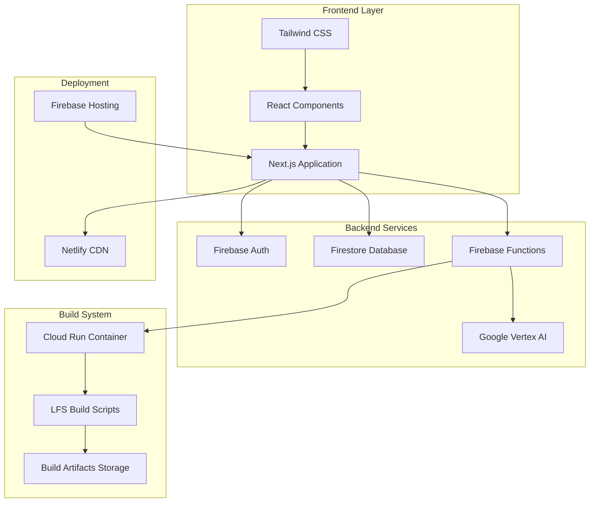
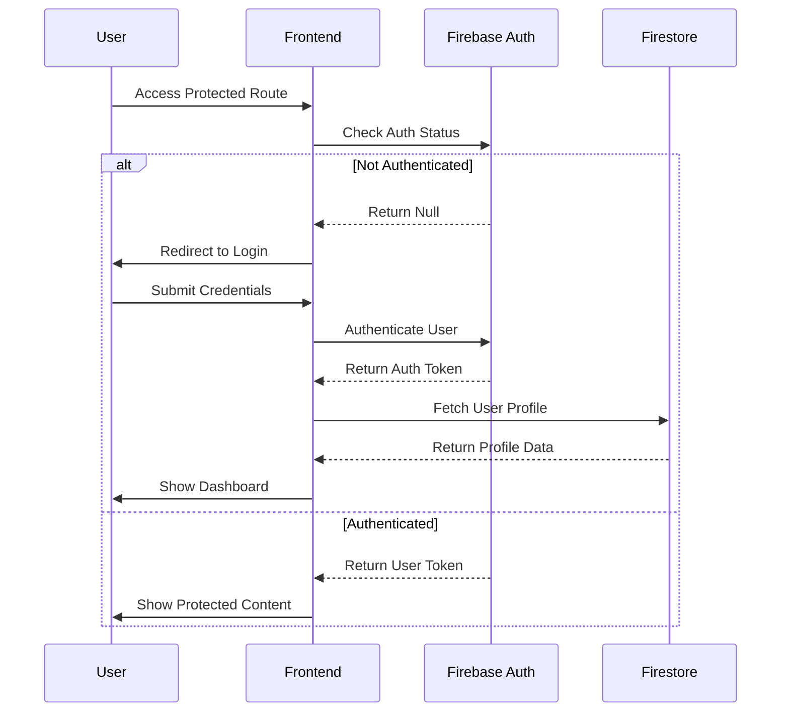
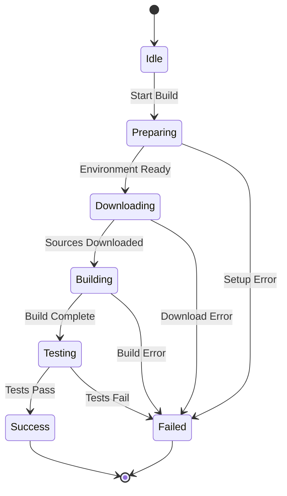
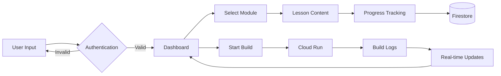
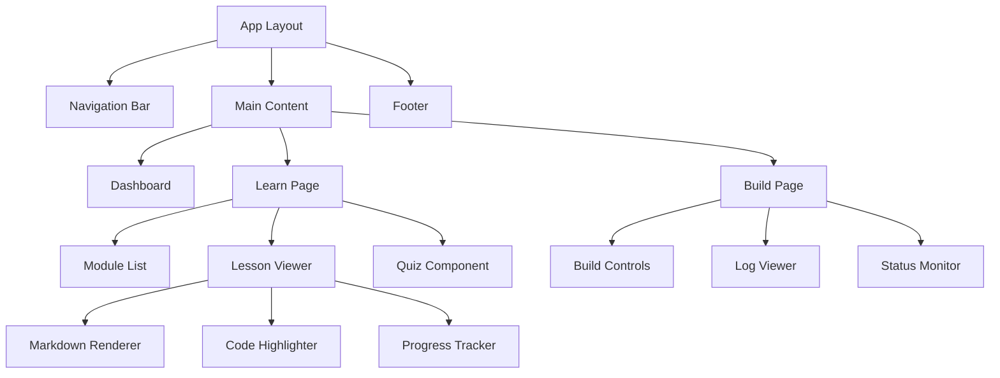
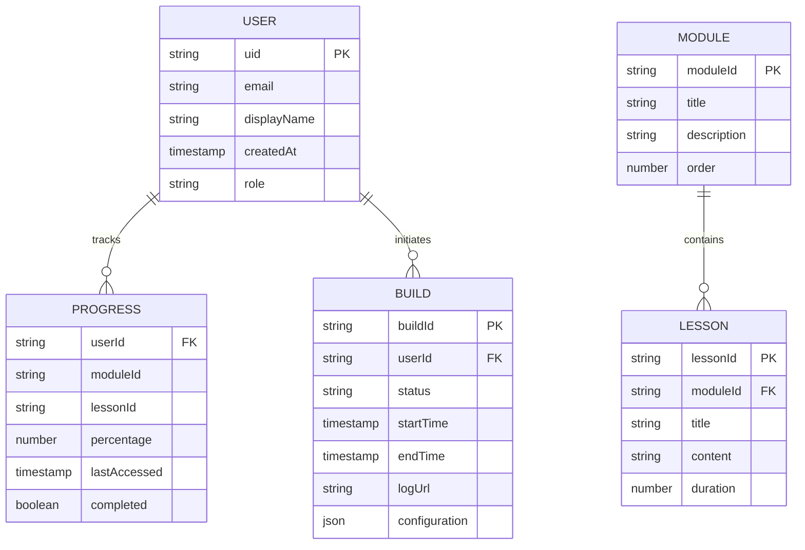
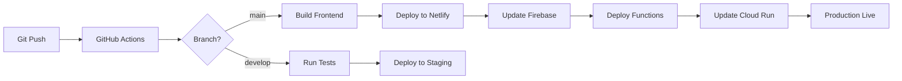
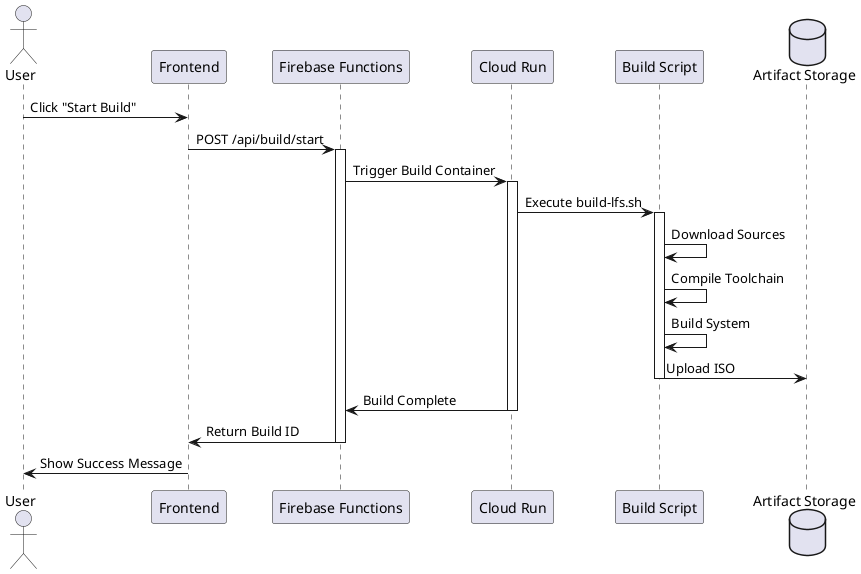
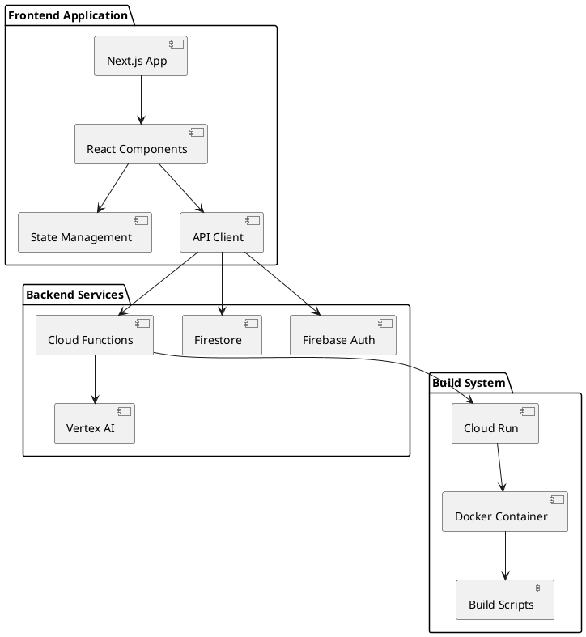
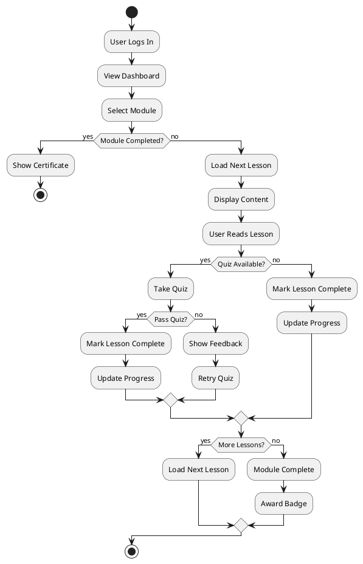

# Diagram Generation Prompts Reference

This document provides prompts for generating various types of diagrams for the LFS Automated Build System thesis using different tools.

## Table of Contents
1. [Mermaid Diagrams](#mermaid-diagrams)
2. [Google Drawings / Diagrams.net](#google-drawings--diagramsnet)
3. [PlantUML](#plantuml)
4. [Excalidraw](#excalidraw)

---

## Mermaid Diagrams

Mermaid is a JavaScript-based diagramming tool that renders markdown-inspired text definitions.

### 1. System Architecture Diagram



**Prompt for AI Generation:**
"Create a Mermaid architecture diagram showing the LFS Automated Build System with four layers: Frontend (Next.js, React, Tailwind), Backend Services (Firebase Auth, Firestore, Functions, Vertex AI), Build System (Cloud Run, LFS Scripts, Storage), and Deployment (Netlify, Firebase Hosting). Show connections between components."

### 2. User Authentication Flow



**Prompt for AI Generation:**
"Create a Mermaid sequence diagram for user authentication flow in the LFS system. Show interactions between User, Frontend, Firebase Auth, and Firestore. Include both authenticated and non-authenticated paths with conditional logic."

### 3. Build Process State Machine



**Prompt for AI Generation:**
"Create a Mermaid state diagram showing the LFS build process lifecycle. States: Idle, Preparing, Downloading, Building, Testing, Success, Failed. Show transitions and error paths."

### 4. Data Flow Diagram



**Prompt for AI Generation:**
"Create a Mermaid flowchart showing data flow in the LFS learning platform. Include user authentication, module selection, lesson viewing, progress tracking to Firestore, and build process with real-time log updates."

### 5. Component Hierarchy



**Prompt for AI Generation:**
"Create a Mermaid component hierarchy diagram for the LFS learning platform. Show the main App Layout with Navigation, Content, and Footer. Break down Learn Page and Build Page into their sub-components."

### 6. Database Schema (Entity Relationship)



**Prompt for AI Generation:**
"Create a Mermaid ER diagram for the LFS system database. Entities: USER, PROGRESS, BUILD, MODULE, LESSON. Show relationships and key attributes for each entity."

### 7. Deployment Pipeline



**Prompt for AI Generation:**
"Create a Mermaid deployment pipeline diagram showing the CI/CD process from Git push through GitHub Actions, branch-based deployment (main to production, develop to staging), and deployment to Netlify, Firebase, and Cloud Run."

---

## Google Drawings / Diagrams.net (Draw.io)

These prompts are for creating diagrams using Google Drawings or Diagrams.net.

### 1. System Architecture Diagram

**Prompt:**
"Create a layered architecture diagram with four horizontal layers:
- **Top Layer (Frontend)**: Three rounded rectangles labeled 'Next.js App', 'React Components', 'Tailwind CSS'
- **Second Layer (Backend)**: Four rectangles labeled 'Firebase Auth', 'Firestore', 'Firebase Functions', 'Vertex AI'
- **Third Layer (Build)**: Three rectangles labeled 'Cloud Run', 'LFS Scripts', 'Artifact Storage'
- **Bottom Layer (Deployment)**: Two rectangles labeled 'Netlify CDN', 'Firebase Hosting'

Use arrows to show:
- Frontend connects to all Backend services
- Firebase Functions connects to Vertex AI and Cloud Run
- Cloud Run connects to LFS Scripts and Storage
- Frontend deploys to both Netlify and Firebase Hosting

Color scheme: Blue for Frontend, Green for Backend, Orange for Build, Purple for Deployment"

### 2. User Journey Map

**Prompt:**
"Create a horizontal user journey map with 5 stages:
1. **Discovery**: User finds LFS learning platform (icon: magnifying glass)
2. **Registration**: User creates account (icon: user profile)
3. **Learning**: User completes modules (icon: book)
4. **Building**: User initiates LFS build (icon: gear)
5. **Completion**: User downloads ISO (icon: download)

For each stage, add:
- User actions (below the stage)
- System responses (above the stage)
- Emotional state (emoji: 😊 for positive, 😐 for neutral, 😟 for pain points)
- Touchpoints (web interface, email, documentation)

Use a timeline arrow connecting all stages from left to right."

### 3. Network Topology Diagram

**Prompt:**
"Create a network topology diagram showing:
- **User's Browser** (laptop icon) at the top
- **Netlify CDN** (cloud icon) connected to browser
- **Firebase Services** (three server icons) connected to CDN:
  - Authentication Server
  - Firestore Database
  - Cloud Functions
- **Google Cloud Platform** (cloud icon) connected to Firebase:
  - Cloud Run Container
  - Vertex AI Service
  - Cloud Storage Bucket
- **Build Environment** (container icon) inside Cloud Run

Use different line styles:
- Solid lines for HTTPS connections
- Dashed lines for internal API calls
- Dotted lines for async/event-driven connections

Add labels showing protocols (HTTPS, gRPC, WebSocket)"

### 4. Class Diagram

**Prompt:**
"Create a UML class diagram with these classes:

**User Class**
- Properties: uid, email, displayName, role, createdAt
- Methods: login(), logout(), updateProfile()

**Module Class**
- Properties: moduleId, title, description, lessons[]
- Methods: getLessons(), getProgress()

**Lesson Class**
- Properties: lessonId, title, content, duration
- Methods: markComplete(), getContent()

**Build Class**
- Properties: buildId, userId, status, startTime, logs[]
- Methods: start(), stop(), getLogs()

**ProgressTracker Class**
- Properties: userId, moduleId, percentage, completed
- Methods: updateProgress(), getProgress()

Show relationships:
- User has many ProgressTracker (1 to many)
- User has many Build (1 to many)
- Module contains many Lesson (1 to many)
- ProgressTracker references Module (many to 1)"

### 5. Infrastructure Diagram

**Prompt:**
"Create a detailed infrastructure diagram showing:

**Frontend Infrastructure:**
- Netlify Edge Network (multiple nodes globally)
- CDN caching layer
- SSL/TLS termination

**Backend Infrastructure:**
- Firebase Project container with:
  - Authentication service
  - Firestore database (with regions)
  - Cloud Functions (Node.js runtime)
  - Cloud Storage buckets

**Build Infrastructure:**
- Google Cloud Run service
- Container registry
- Build artifact storage
- Log aggregation service

**Monitoring & Analytics:**
- Firebase Analytics
- Cloud Monitoring
- Error tracking (Sentry/similar)

Use cloud icons, server racks, and database cylinders. Show data flow with numbered arrows (1, 2, 3...) to indicate request/response sequence."

---

## PlantUML

PlantUML is a component that allows to quickly write diagrams using a simple text language.

### 1. Sequence Diagram - Build Process



**Prompt for AI Generation:**
"Create a PlantUML sequence diagram showing the LFS build process. Actors: User, Frontend, Firebase Functions, Cloud Run, Build Script, Artifact Storage. Show the complete flow from user clicking 'Start Build' to receiving the completed ISO."

### 2. Component Diagram



**Prompt for AI Generation:**
"Create a PlantUML component diagram showing three packages: Frontend Application (Next.js, React, State Management, API Client), Backend Services (Firebase Auth, Firestore, Functions, Vertex AI), and Build System (Cloud Run, Build Scripts, Docker Container). Show dependencies between components."

### 3. Activity Diagram - User Learning Flow



**Prompt for AI Generation:**
"Create a PlantUML activity diagram for the user learning flow. Include: login, dashboard view, module selection, lesson progression, quiz taking with pass/fail logic, progress tracking, and module completion with badges."

---

## Excalidraw

Excalidraw is a hand-drawn style diagramming tool. These prompts describe what to draw.

### 1. System Overview (Hand-drawn Style)

**Prompt:**
"Create a hand-drawn style system overview diagram:
- Draw a large rectangle labeled 'LFS Learning Platform' in the center
- On the left, draw a stick figure labeled 'User' with a laptop
- Inside the main rectangle, draw three sections:
  - Top: 'Web Interface' (browser window sketch)
  - Middle: 'Learning Modules' (stack of books icon)
  - Bottom: 'Build System' (gear icons)
- On the right, draw cloud shapes for:
  - 'Firebase' (with database icon)
  - 'Google Cloud' (with container icon)
- Draw arrows showing:
  - User → Web Interface
  - Web Interface ↔ Firebase
  - Build System → Google Cloud
- Add small annotations with key technologies (Next.js, React, Docker)
- Use hand-drawn style with rough edges and casual fonts"

### 2. Data Flow Sketch

**Prompt:**
"Create a hand-drawn data flow sketch:
- Start with a circle labeled 'User Action' on the left
- Draw a wavy arrow to a rectangle 'Frontend'
- From Frontend, draw three arrows to:
  - 'Auth Service' (shield icon)
  - 'Database' (cylinder shape)
  - 'API' (cloud shape)
- From API, draw arrow to 'Build Service' (gear icon)
- From Build Service, draw arrow back to Frontend
- From Frontend, draw arrow back to User (circle)
- Add small sticky notes with labels:
  - 'Login credentials'
  - 'User data'
  - 'Build request'
  - 'Build status'
- Use different colors for different data types (blue for auth, green for data, orange for builds)"

### 3. User Interface Wireframe

**Prompt:**
"Create a hand-drawn wireframe of the main dashboard:
- Draw a large rectangle for the browser window
- At the top, draw a navigation bar with:
  - Logo (penguin sketch) on the left
  - Menu items: Home, Learn, Build, Docs
  - User profile icon on the right
- Below nav, draw three cards in a row:
  - Card 1: 'Progress' with a circular progress indicator (75%)
  - Card 2: 'Current Module' with a book icon
  - Card 3: 'Recent Builds' with a list of items
- Below cards, draw a large section:
  - Left sidebar: List of modules (checkboxes)
  - Main area: Lesson content (wavy lines representing text)
  - Right sidebar: Table of contents
- At the bottom, draw a footer with links
- Use hand-drawn style with annotations and arrows pointing to key features"

---

## Diagram Prompts for Specific Tools

### For Canva

**System Architecture Infographic:**
"Create an infographic-style system architecture:
- Use Canva's 'Tech Infographic' template
- Top section: Title 'LFS Automated Build System Architecture'
- Three columns:
  - Column 1: 'Frontend' with icons for Next.js, React, Tailwind
  - Column 2: 'Backend' with icons for Firebase, Cloud Functions, AI
  - Column 3: 'Infrastructure' with icons for Netlify, Cloud Run, Storage
- Use connecting lines with icons showing data flow
- Add statistics boxes: '10+ Modules', '50+ Lessons', '99.9% Uptime'
- Use modern tech color scheme (blues, purples, greens)
- Add small descriptions under each component"

### For Lucidchart

**Detailed Technical Architecture:**
"Create a detailed technical architecture diagram in Lucidchart:
- Use the 'AWS Architecture' template but adapt for Google Cloud/Firebase
- Top layer: User devices (web browsers, mobile)
- CDN layer: Netlify edge nodes
- Application layer: Next.js application with component breakdown
- Service layer: Firebase services (Auth, Firestore, Functions, Storage)
- Compute layer: Google Cloud Run with container details
- Data layer: Firestore collections and Cloud Storage buckets
- Add security zones with different background colors
- Show load balancers, API gateways, and caching layers
- Include network protocols and ports
- Add legends for icons and connection types"

### For Microsoft Visio

**Enterprise Architecture Diagram:**
"Create an enterprise-level architecture diagram:
- Use Visio's 'Cloud and Enterprise' stencils
- Organize in swim lanes:
  - Presentation Layer
  - Application Layer
  - Service Layer
  - Data Layer
  - Infrastructure Layer
- For each layer, show:
  - Components (with official logos)
  - Connections (with protocols)
  - Security boundaries (firewalls, VPNs)
  - Redundancy and failover paths
- Add a separate section for:
  - Monitoring and logging
  - Backup and disaster recovery
  - CI/CD pipeline
- Use standard enterprise architecture notation
- Include capacity and scaling information"

---

## AI Image Generation Prompts (DALL-E, Midjourney, Stable Diffusion)

### Conceptual System Diagram

**Prompt:**
"Create a professional technical diagram illustration showing a modern web application architecture. Central focus on a glowing blue server cluster representing cloud infrastructure. On the left, show multiple user devices (laptops, tablets, phones) connected via glowing network lines. On the right, show database cylinders and storage containers. Above, show a shield icon for security and a brain icon for AI services. Use a dark background with neon blue, purple, and green accent colors. Isometric perspective, clean lines, tech aesthetic, professional infographic style."

### Learning Platform Concept Art

**Prompt:**
"Create a conceptual illustration of an online learning platform for Linux system building. Show a 3D isometric view of a digital workspace with: a large monitor displaying code and terminal windows, floating holographic panels showing lesson modules, a penguin mascot (Linux Tux) as a guide, building blocks representing system components, and glowing connection lines showing the build process. Use a modern tech color palette with blues, cyans, and whites. Professional, clean, educational technology aesthetic."

---

## Summary Table

| Diagram Type | Best Tool | Complexity | Use Case |
|--------------|-----------|------------|----------|
| Architecture | Mermaid, Lucidchart | Medium | System overview |
| Sequence | PlantUML, Mermaid | Medium | Process flows |
| State Machine | Mermaid | Low | Build lifecycle |
| Data Flow | Diagrams.net | Medium | Data movement |
| Component | PlantUML | High | Code structure |
| ER Diagram | Mermaid | Medium | Database schema |
| Deployment | Mermaid, Visio | High | Infrastructure |
| Wireframe | Excalidraw, Figma | Low | UI design |
| Infographic | Canva | Low | Presentations |
| Conceptual | AI Image Gen | Low | Marketing/Docs |

---

## Tips for Diagram Generation

1. **Start Simple**: Begin with basic shapes and connections, then add detail
2. **Use Consistent Styling**: Stick to one color scheme and icon style
3. **Label Everything**: Clear labels prevent confusion
4. **Show Data Flow**: Use arrows to indicate direction
5. **Group Related Items**: Use containers or background colors
6. **Add Legends**: Explain symbols and colors used
7. **Keep It Readable**: Don't overcrowd the diagram
8. **Version Control**: Save iterations as you refine
9. **Export Multiple Formats**: PNG for docs, SVG for web, PDF for print
10. **Test Understanding**: Show to someone unfamiliar with the system

---

## Quick Reference: Mermaid Syntax

```
graph: Flowchart
sequenceDiagram: Sequence diagram
classDiagram: Class diagram
stateDiagram: State diagram
erDiagram: Entity relationship
gantt: Gantt chart
pie: Pie chart
journey: User journey
```

For more details, visit: https://mermaid.js.org/
