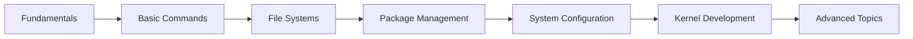

# Getting Started with LFS Learning Platform

Welcome to the **LFS Learning Platform** - your comprehensive guide to building Linux From Scratch! 🚀

## What is Linux From Scratch?

Linux From Scratch (LFS) is a project that provides you with step-by-step instructions for building your own custom Linux system, entirely from source code.

### Why Learn LFS?

- **Deep Understanding**: Learn exactly how a Linux system works from the ground up
- **Complete Control**: Build a system tailored to your exact needs
- **Educational Value**: Understand package management, compilation, and system architecture
- **Career Skills**: Gain expertise valued by employers in DevOps, systems engineering, and beyond

## Platform Features

Our platform provides:

1. **Interactive Learning Modules** - Step-by-step lessons with hands-on exercises
2. **Real Terminal Access** - Practice commands in a safe, isolated environment
3. **Progress Tracking** - Monitor your learning journey
4. **Build System** - Automated LFS build pipeline
5. **Community Support** - Learn alongside other Linux enthusiasts

## Quick Start

### 1. Create Your Account

Sign up to save your progress and access all features:

```bash
# Visit /signup to create your account
# Or use Google Sign-In for quick access
```

### 2. Complete Your Profile

Tell us about your experience level so we can customize your learning path.

### 3. Start Learning

Begin with our **Fundamentals** module to get oriented, or jump right into specific topics:

- **Basic Commands** - Master the Linux command line
- **File Systems** - Understand how Linux organizes data
- **Package Management** - Learn to compile and manage software
- **System Configuration** - Configure your Linux system
- **Kernel Development** - Build and customize the Linux kernel
- **Advanced Topics** - Security, networking, and more

## Learning Path

We recommend following this progression:



### Estimated Time

- **Fundamentals**: 2-3 hours
- **Basic Commands**: 4-5 hours
- **File Systems**: 3-4 hours
- **Package Management**: 5-6 hours
- **System Configuration**: 6-8 hours
- **Kernel Development**: 8-10 hours
- **Advanced Topics**: 10+ hours

**Total**: Approximately 40-50 hours to complete all modules

## Interactive Terminal

One of our most powerful features is the integrated terminal. Try these commands:

```bash
# Check system information
uname -a

# List directory contents
ls -lah

# Check disk usage
df -h

# View running processes
ps aux
```

Each command page includes a **"Try in Terminal"** button that opens a pre-configured terminal with the command ready to run.

## Build Your First LFS System

Once you've completed the core modules, you can use our automated build system to create your first LFS system:

1. Navigate to the **Build** page
2. Configure your build parameters
3. Launch the build
4. Monitor progress in real-time
5. Download your completed system

## Getting Help

Need assistance? We've got you covered:

- **Documentation**: Comprehensive guides for every topic
- **Commands Reference**: Searchable database of Linux commands
- **Community**: Connect with other learners
- **Support**: Contact us at [contact@lfslearning.com](mailto:contact@lfslearning.com)

## Next Steps

Ready to begin? Here's what to do next:

1. ✅ [Complete your profile](/profile)
2. ✅ [Start the Fundamentals module](/learn/fundamentals)
3. ✅ [Explore available commands](/commands)
4. ✅ [Try the interactive terminal](/terminal)
5. ✅ [Join the community](/community)

---

## Tips for Success

### 1. Practice Regularly

Set aside dedicated time each day or week for learning. Consistency is key!

### 2. Take Notes

Document your learning journey. Write down:
- Commands you find useful
- Concepts that click
- Questions to explore later

### 3. Experiment Safely

Our isolated terminal environment is perfect for experimentation. Don't be afraid to:
- Try different command variations
- Break things and fix them
- Explore beyond the lessons

### 4. Build Projects

Apply what you learn by building real projects:
- Set up a web server
- Create automated scripts
- Build your own tools

### 5. Stay Curious

Linux is vast and constantly evolving. Keep exploring, asking questions, and learning!

---

## System Requirements

To get the most out of this platform:

- **Browser**: Modern browser (Chrome, Firefox, Edge, Safari)
- **Internet**: Stable connection for interactive features
- **Account**: Free account to save progress

That's it! No software to install, no complex setup.

---

## About the Creator

This platform was created by **Shubham Bhasker**, a Linux systems developer passionate about making Linux education accessible to everyone.

Learn more on the [About page](/about).

---

**Ready to start your Linux journey?** [Begin Learning →](/learn)
