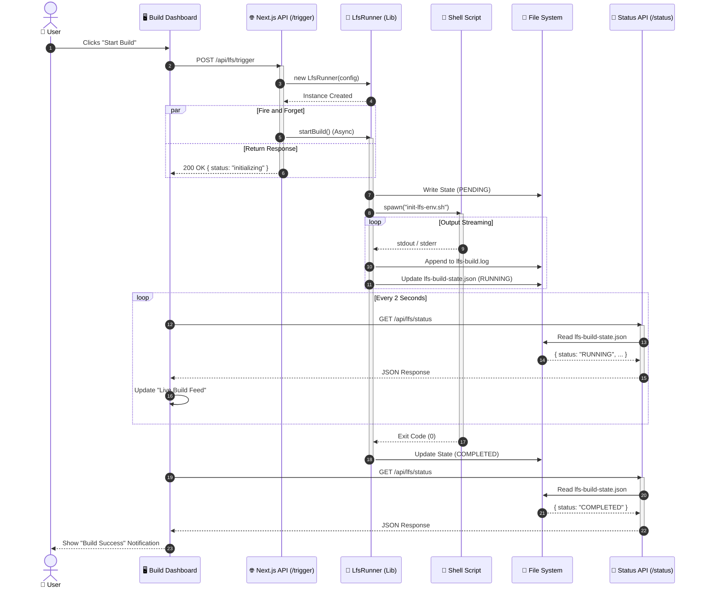

# LFS Build Sequence: "The Life of a Build"

This sequence diagram visualizes the asynchronous communication flow between the Frontend, the Next.js API, the Background Runner, and the File System throughout the build lifecycle.

## Flow Description

1.  **Initiation**: The user triggers the action. The API creates the `LfsRunner` but responds immediately to the UI to prevent hanging the browser request. This is the **Fire-and-Forget** pattern.
2.  **Execution**: The `LfsRunner` acts as a background worker. It spawns the shell script (e.g., `init-lfs-env.sh`) and listens to its output streams in real-time.
3.  **Persistence**: Because Next.js serverless functions are stateless, we use the File System (`lfs-build-state.json`) as a shared "database" to store the current status.
4.  **Monitoring**: The Frontend polls the Status API, which simply reads the shared file to report progress back to the user.
