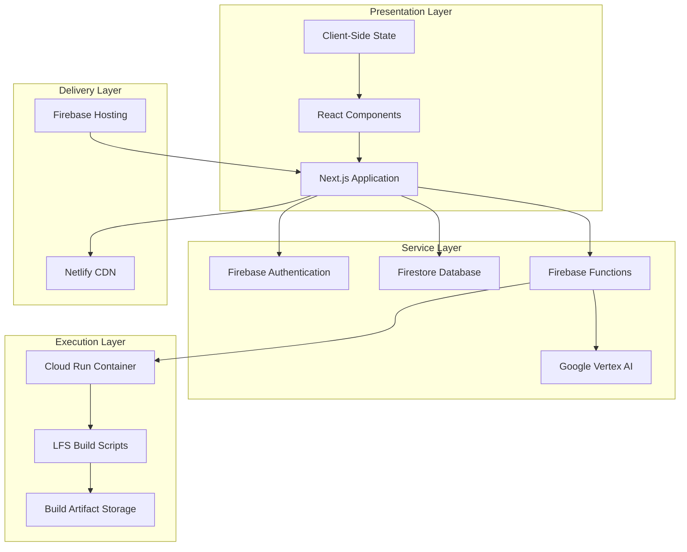

# Chapter 4: System Design

## 4.1 Architecture Overview

The LFS Automated Build System employs a modern, cloud-native architecture designed for scalability, reliability, and educational effectiveness. The system is organized into three primary tiers: the presentation layer (frontend), the service layer (backend), and the execution layer (build system).

### 4.1.1 High-Level Architecture



### 4.1.2 Architectural Principles

The system design adheres to the following principles:

1. **Separation of Concerns**: Clear boundaries between presentation, business logic, and data persistence
2. **Scalability**: Horizontal scaling through serverless functions and containerized builds
3. **Resilience**: Graceful degradation and error recovery mechanisms
4. **Security**: Defense-in-depth with authentication, authorization, and data encryption
5. **Observability**: Comprehensive logging, monitoring, and analytics
6. **Maintainability**: Modular design with well-defined interfaces
7. **Performance**: Optimized for fast page loads and responsive interactions

### 4.1.3 Technology Stack

| Layer | Technology | Version | Purpose |
|-------|-----------|---------|---------|
| **Frontend** | Next.js | 16.0.1 | React framework with SSR |
| | React | 19.2.0 | UI component library |
| | TypeScript | 5.x | Type-safe development |
| | Tailwind CSS | 4.x | Utility-first styling |
| | Framer Motion | 12.23.24 | Animation library |
| **Backend** | Firebase Auth | 12.5.0 | User authentication |
| | Firestore | 12.5.0 | NoSQL database |
| | Firebase Functions | 4.7.0 | Serverless functions |
| | Vertex AI | 1.10.0 | AI chat assistant |
| **Build** | Google Cloud Run | Latest | Container orchestration |
| | Docker | 24.x | Containerization |
| | Bash | 5.x | Build scripting |
| **Deployment** | Netlify | Latest | Frontend hosting |
| | Firebase Hosting | Latest | Static assets |
| **Testing** | Vitest | 2.0.0 | Unit testing |
| | fast-check | 4.3.0 | Property-based testing |

### 4.1.4 Data Flow

The system implements several key data flows:

**User Authentication Flow:**
```
User → Frontend → Firebase Auth → Firestore → Frontend → User
```

**Learning Content Flow:**
```
User → Frontend → Static Content → Markdown Renderer → Display
```

**Progress Tracking Flow:**
```
User Action → Frontend → Firestore → Real-time Listener → UI Update
```

**Build Execution Flow:**
```
User → Frontend → Firebase Function → Cloud Run → Build Script → Storage → Frontend
```

**AI Chat Flow:**
```
User Query → Frontend → Firebase Function → Vertex AI → Response → Frontend
```

## 4.2 Frontend Design

The frontend is built using Next.js 16 with the App Router, providing server-side rendering, static site generation, and optimal performance.

### 4.2.1 Application Structure

```
lfs-learning-platform/
├── app/                      # Next.js App Router
│   ├── (auth)/              # Authentication routes
│   │   ├── login/
│   │   └── signup/
│   ├── api/                 # API routes
│   │   ├── ai/             # AI chat endpoints
│   │   ├── build/          # Build management
│   │   └── progress/       # Progress tracking
│   ├── dashboard/          # User dashboard
│   ├── learn/              # Learning modules
│   │   └── [moduleId]/    # Dynamic module routes
│   ├── build/              # Build interface
│   ├── docs/               # Documentation
│   ├── layout.tsx          # Root layout
│   └── page.tsx            # Landing page
├── components/             # React components
│   ├── ui/                # Reusable UI components
│   ├── auth/              # Auth components
│   ├── lfs/               # LFS-specific components
│   └── wizard/            # Installation wizard
├── contexts/              # React contexts
│   ├── AuthContext.tsx   # Authentication state
│   └── WizardContext.tsx # Wizard state
├── lib/                   # Utilities and services
│   ├── firebase.ts       # Firebase initialization
│   ├── services/         # Service layer
│   ├── hooks/            # Custom React hooks
│   └── utils/            # Utility functions
└── data/                  # Static data
    └── lessons.ts        # Lesson content
```

### 4.2.2 Component Architecture

The frontend follows a component-based architecture with clear separation between:

**Container Components**: Manage state and business logic
- `DashboardContainer`
- `LessonViewerContainer`
- `BuildManagerContainer`

**Presentation Components**: Pure UI components
- `Card`, `Button`, `Badge`
- `ProgressBar`, `CodeBlock`
- `LessonContent`, `ModuleList`

**Layout Components**: Page structure
- `GlobalNavBar`
- `Sidebar`
- `Footer`

**Feature Components**: Complex, domain-specific
- `AIChat`
- `BuildLogViewer`
- `ProgressTracker`
- `InstallationWizard`

### 4.2.3 State Management

State is managed through a combination of:

1. **React Context**: Global state (authentication, theme)
2. **Component State**: Local UI state (form inputs, modals)
3. **Server State**: Data from Firestore (cached and synchronized)
4. **URL State**: Navigation and routing parameters

### 4.2.4 Routing Strategy

The application uses Next.js App Router with:

- **Static Routes**: `/`, `/docs`, `/contact`
- **Dynamic Routes**: `/learn/[moduleId]`, `/learn/[moduleId]/[lessonId]`
- **API Routes**: `/api/ai/chat`, `/api/build/start`
- **Protected Routes**: Wrapped with authentication checks

### 4.2.5 Responsive Design

The interface adapts to three breakpoints:

- **Mobile**: < 768px (single column, hamburger menu)
- **Tablet**: 768px - 1024px (two columns, collapsible sidebar)
- **Desktop**: > 1024px (three columns, persistent sidebar)

### 4.2.6 Accessibility Features

- **WCAG 2.1 AA Compliance**: Semantic HTML, ARIA labels, keyboard navigation
- **Screen Reader Support**: Descriptive labels and announcements
- **Color Contrast**: Minimum 4.5:1 ratio for text
- **Focus Management**: Visible focus indicators and logical tab order
- **Alternative Text**: All images and icons have descriptive alt text

## 4.3 Backend Services

The backend leverages Firebase and Google Cloud Platform services for authentication, data persistence, serverless functions, and AI capabilities.

### 4.3.1 Firebase Authentication

**Features:**
- Email/password authentication
- Google OAuth integration
- Session management with JWT tokens
- Password reset and email verification

**Security Rules:**
```javascript
// Firestore security rules
rules_version = '2';
service cloud.firestore {
  match /databases/{database}/documents {
    // Users can only read/write their own data
    match /users/{userId} {
      allow read, write: if request.auth != null && request.auth.uid == userId;
    }
    
    // Progress data is user-specific
    match /progress/{userId}/{document=**} {
      allow read, write: if request.auth != null && request.auth.uid == userId;
    }
    
    // Modules and lessons are public read
    match /modules/{moduleId} {
      allow read: if true;
      allow write: if request.auth != null && 
                      get(/databases/$(database)/documents/users/$(request.auth.uid)).data.role == 'admin';
    }
  }
}
```

### 4.3.2 Firestore Database Schema

**Collections:**

1. **users**: User profiles and metadata
```typescript
{
  uid: string;
  email: string;
  displayName: string;
  photoURL: string | null;
  createdAt: Timestamp;
  lastLogin: Timestamp;
  role: 'user' | 'admin';
  progress: {
    modulesCompleted: number;
    lessonsCompleted: number;
    commandsTried: number;
    totalTimeSpent: number;
  };
  enrollments: string[];  // Module IDs
  favorites: string[];    // Lesson IDs
}
```

2. **progress**: User learning progress
```typescript
{
  userId: string;
  moduleId: string;
  lessonId: string;
  completed: boolean;
  percentage: number;
  lastAccessed: Timestamp;
  timeSpent: number;
  quizScores: number[];
}
```

3. **builds**: Build execution records
```typescript
{
  buildId: string;
  userId: string;
  status: 'pending' | 'running' | 'success' | 'failed';
  startTime: Timestamp;
  endTime: Timestamp | null;
  logUrl: string;
  configuration: {
    version: string;
    packages: string[];
    options: Record<string, any>;
  };
  artifacts: {
    isoUrl: string;
    size: number;
    checksum: string;
  } | null;
}
```

### 4.3.3 Firebase Functions

**Deployed Functions:**

1. **startBuild**: Initiates LFS build process
```typescript
export const startBuild = functions.https.onCall(async (data, context) => {
  // Verify authentication
  if (!context.auth) {
    throw new functions.https.HttpsError('unauthenticated', 'User must be authenticated');
  }
  
  // Create build record
  const buildId = generateBuildId();
  await db.collection('builds').doc(buildId).set({
    userId: context.auth.uid,
    status: 'pending',
    startTime: admin.firestore.FieldValue.serverTimestamp(),
    configuration: data.config
  });
  
  // Trigger Cloud Run container
  await triggerCloudRun(buildId, data.config);
  
  return { buildId };
});
```

2. **chatWithAI**: Handles AI chat interactions
```typescript
export const chatWithAI = functions.https.onCall(async (data, context) => {
  const { message, conversationHistory } = data;
  
  // Call Vertex AI
  const response = await vertexAI.generateContent({
    prompt: message,
    context: conversationHistory,
    systemPrompt: LFS_EXPERT_PROMPT
  });
  
  return { response: response.text };
});
```

3. **updateProgress**: Tracks user learning progress
```typescript
export const updateProgress = functions.https.onCall(async (data, context) => {
  const { moduleId, lessonId, completed, percentage } = data;
  
  await db.collection('progress').doc(`${context.auth.uid}_${moduleId}_${lessonId}`).set({
    userId: context.auth.uid,
    moduleId,
    lessonId,
    completed,
    percentage,
    lastAccessed: admin.firestore.FieldValue.serverTimestamp()
  }, { merge: true });
  
  return { success: true };
});
```
